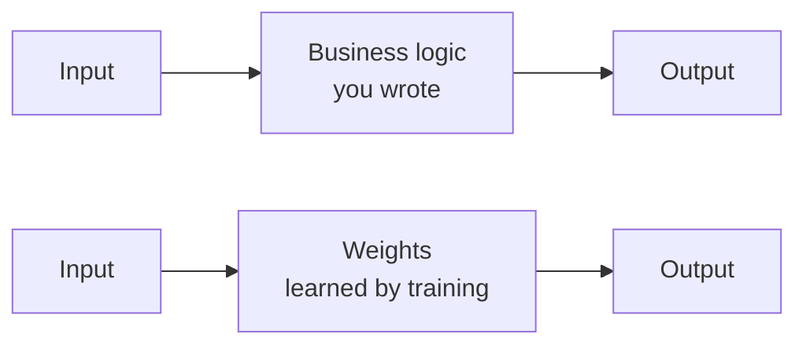

(ch-01)=
# 1. Machine Learning Without the Mystery
 
A machine learning model (ML) is a function. `F(input) -> output`. That's the whole thing.
 
The mystery is not in *what* it is. It's in *how it got written*.
 
If in traditional code you write the rules. `if (age >= 18) return true;` You reasoned about the problem, you typed it in. The implementation lives in source you can read, review, and test. 

In ML nobody writes the rules for the model. Instead, you feed it thousands of examples: inputs paired with correct outputs. An algorithm adjusts internal numbers, called **weights** or **parameters**, until the function's outputs match those examples closely enough. The implementation doesn't live in source code. It lives in a very large array of `double`s, plus a fixed procedure for turning input numbers into output numbers using those `double`s.
 
Think of it as `Function<Input, Output>` whose body is not logic you wrote but a matrix of floats, and the execution is: multiply input by weights, pass through an activation function, repeat across layers until you get an output.
 

 
Three ideas carry the rest of this book:
 
**Training** is searching for good weight values. You feed data. An algorithm computes how wrong the outputs are, then nudges every weight in the direction that reduces that error - layer by layer, backward through the network. This is the so-called Backward Pass. The optimizer steering those nudges is the blessed `ADAM` gradient algorithm. It is genuinely the most magical part, and later we will gets into how it actually works [Chapter 6](#ch-06).
 
**Inference** is running the already-trained function on new input. The Forward Pass. Input goes in, output comes out. Deterministic matrix math. This is the part that looks like calling a method in production - fast, repeatable, no learning happening.
 
**The model** is the artifact in ML. Not a source code. A binary file containing all the learned weights, physically distributed the same way a `.jar` distributes bytecode: you ship it, you load it, you run it. It just happens to be gigabytes instead of megabytes, and what's inside is floating-point matrices instead of JVM instructions. It won't magically know things outside its training data, same way a method you never tested won't magically handle edge cases you never wrote a case for.
 
---
 
**Why this maps cleanly for Java developers.** The training vs inference split is compile-time vs. runtime - a distinction you've internalized deeply. Training is slow, expensive, done once or occasionally. Inference is fast, done on every request. A model is only as good as its training data [Chapter 3](#ch-03), same as code is only as good as its test coverage. Nothing here requires you to abandon engineering instincts. It requires redirecting them at a new kind of artifact: a weights file instead of a `.jar`.
 
That's the mental model. The rest of the book builds on it.

---

[Table of Contents](../index.md) &nbsp;|&nbsp; [Chapter 2: From if/else Rules to Learned Behaviour: When Models Replace Hard-Coded Logic →](#ch-02)