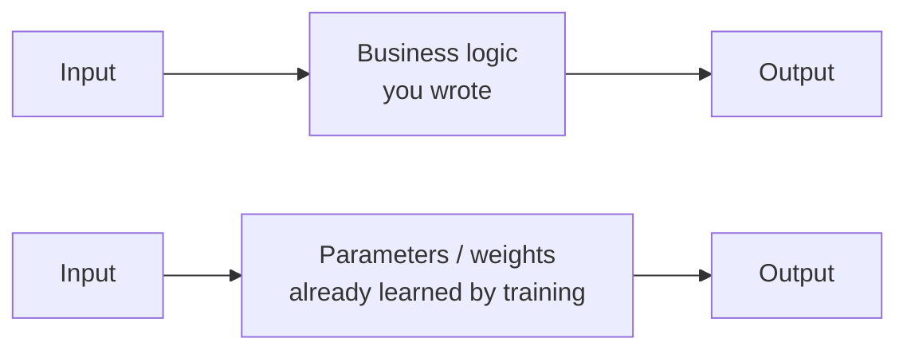

(ch-01)=
# 1. Machine Learning Without the Mystery: A Developer's Mental Model
A machine learning process is a function. That's it. `F(input) -> output`. The mystery isn't in what it is, because it's in how it got written. Let's compare two ways of producing a result: programming function and inference engine:

- **We write code** `if (age >= 18) return true;` We reasoned about the rule and typed it in.

- **A model learns from examples.** Nobody writes `if`. Instead, we show the function thousands of examples of inputs and correct outputs, and an algorithm adjusts internal numbers (called **parameters** or **weights**) until the function's guesses match the examples closely enough, using gradient search math.

Think of it like a `Function<Input, Output>` whose implementation is not source code but a very large array of `double`s, plus a fixed procedure (matrix multiplications, mostly) for turning input numbers into output numbers using those `double`s.

Three ideas carry the rest of this book:

1. **Training** is the process of *searching* for good parameter values, using data as the search signal. So called Backward Path in ML.
2. **Inference** is *running* the already-trained function on new input: this is the part that looks like calling a method in production. So called Forward Path in ML.
3. **A model** is only as good as the function it approximates. It won't magically know things outside the patterns in its training data, the same way a method you never tested won't magically handle edge cases you never considered.

**Why this matters for Java developers** We already understand the training/inference split intuitively, because it maps to compile-time vs. runtime, which is [Chapter 6](#ch-06). You already understand "the code is only as good as its test coverage": the ML equivalent is "the model is only as good as its training data," [Chapter 3](#ch-03). Nothing here requires you to abandon engineering instincts; it requires you to redirect them at a new kind of artifact: a weights file instead of a `.jar`.

---

[Table of Contents](../index.md) &nbsp;|&nbsp; [Chapter 2: From if/else Rules to Learned Behaviour: When Models Replace Hard-Coded Logic →](#ch-02)
