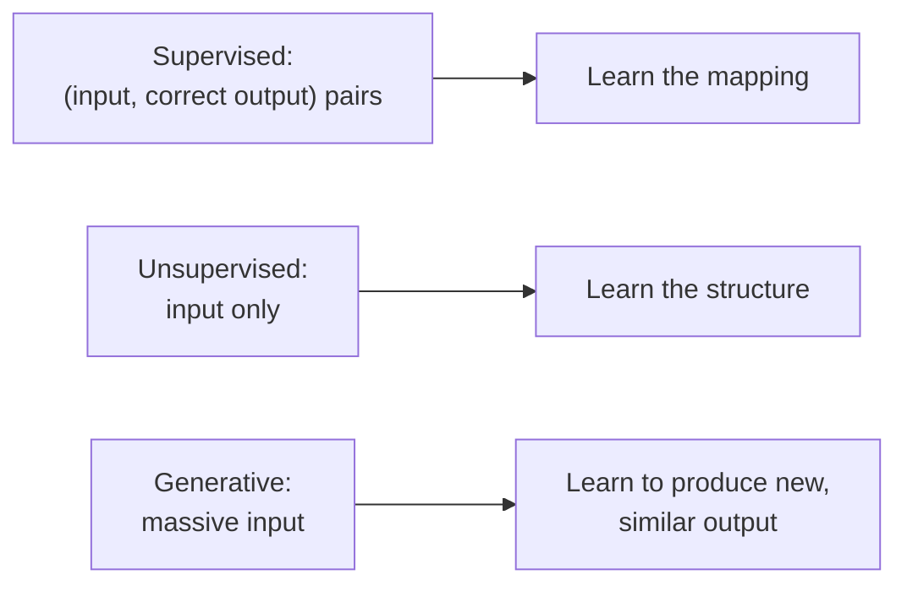

(ch-04)=
# 4. Supervised, Unsupervised, and Generative AI. Explained Like Design Patterns
If ML techniques were design patterns, here's the cheat sheet:

**Supervised learning**: like a `Comparator` you train instead of write. You give the algorithm pairs of (input, correct output) and it learns the mapping. Two flavors:
- **Classification**: output is a category (`isSpam: boolean`, `category: enum`).
- **Regression**: output is a number (`price: double`).

**Unsupervised learning**: like running a `GROUP BY` with no predefined groups. You give the algorithm data with *no* labels and ask it to find structure on its own: clusters of similar customers, anomalies in transaction logs, or a compressed representation of high-dimensional data. Nobody tells it what "similar" means in advance; it infers it from the data's geometry.

**Generative AI**: the newest member, and the odd one out. Instead of predicting a label or finding structure, it learns the underlying *distribution* of the data well enough to produce brand-new, plausible examples: new text, new images, new code. A large language model (LLM) is a generative model trained, at its core, on a deceptively simple supervised task, predicting the next word, applied at a scale that makes the resulting function able to write essays, translate, and summarize.

| Pattern analogy | ML equivalent | Typical use |
|---|---|---|
| `Comparator<T>` trained from examples | Supervised classification | Spam detection, fraud scoring |
| `Function<T, Double>` trained from examples | Supervised regression | Price prediction, demand forecasting |
| Auto-discovering `GROUP BY` keys | Unsupervised clustering | Customer segmentation |
| A `Builder` that invents plausible new objects | Generative model | Chatbots, code completion, image synthesis |

The practical takeaway: when someone says "we should use AI for this," the first question to ask is *which* of these three you actually need. A customer-churn predictor is supervised. A "find weird transactions we didn't think to look for" tool is unsupervised. "Write a draft email for the support agent" is generative. Picking the wrong category wastes months.

---

[← Chapter 3: Data, Features, Labels: How a Dataset Looks If You Think in POJOs](#ch-03) &nbsp;|&nbsp; [Table of Contents](../index.md) &nbsp;|&nbsp; [Chapter 5: Neural Networks as Layers of Math: Matrices You Already Met in Graphics and Games →](#ch-05)
