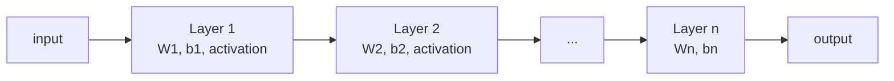
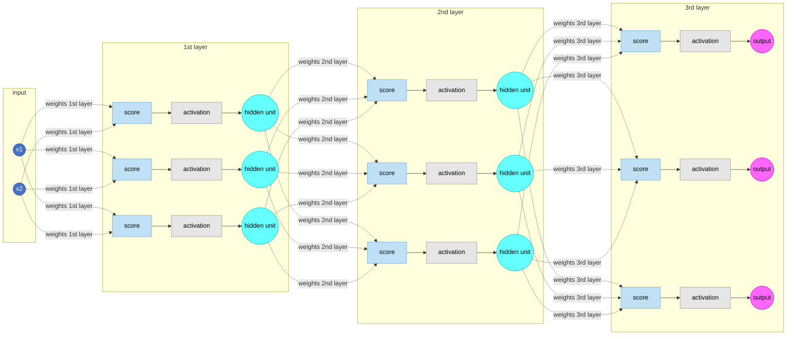

(ch-05)=
# 5. Neural Networks as Layers of Math: Matrices You Already Met in Graphics and Games
If you've ever multiplied a 4x4 matrix by a vertex to rotate a 3D model, you've already done the core operation of a neural network. Everything people call "deep learning magic" reduces to that same primitive, multiply-then-add, repeated across billions of learned numbers and dozens or hundreds of layers instead of the handful of fixed transforms in a graphics pipeline. A neural network layer is, mechanically, this:

```
output = activation(W * input + b)
```

- `W` is a matrix of learned weights (like a rotation/scale matrix in graphics, except the numbers are learned, not derived geometrically).
- `input` is a vector: your data turned into numbers.
- `b` is a bias vector (a learned offset, like a translation).
- `activation` is a small nonlinear function (ReLU, GELU, etc.) applied element-wise. Without it, stacking layers would be pointless, because chained matrix multiplications collapse into one big matrix multiplication, giving you no more expressive power than a single layer. The nonlinearity is what lets the network bend, not just rotate and scale.

A "deep" network is just this operation repeated many times, output feeding into input of the next layer:



Zooming into that chain neuron-by-neuron, the pattern repeats identically at every layer: weighted connections feed a *score* for each unit, a nonlinear *activation function* squashes that score, and the result becomes a *hidden unit* value that the next layer's weights consume as its own input:



Every dotted arrow above is one entry in a `W` matrix: the "weights 1st layer" fan-out from `x1` and `x2` into three scores *is* the matrix-vector multiply from the formula above, just drawn out edge by edge instead of written as `W * input`.

Three labels appear inside every layer of that diagram, and they map directly onto the formula `output = activation(W * input + b)`:

- **score** is the raw, pre-activation number for one neuron: the weighted sum of everything feeding into it, plus its bias (`W * input + b`, for that one row of `W`). It's just a `double`, and on its own it can be any value, positive or negative, arbitrarily large.
- **activation** is the nonlinear function (ReLU, GELU, sigmoid, etc.) applied to that score. It's a fixed, non-learned formula, no weights of its own, that squashes or reshapes the score into the range the next layer expects.
- **hidden unit** is the output of the activation function: the finished value for that neuron, which becomes one entry in the `input` vector the next layer's weights multiply against. "Hidden" simply means it's an intermediate value the network computes for itself, not something you fed in or read back out directly.

So each neuron in the diagram is really three steps performed in place: compute the score, run it through the activation, and hand the result off as a hidden unit to the next layer's weights.

In pseudo-Java, a single layer's forward pass looks almost embarrassingly like code you've already written for a physics or graphics engine:

```java
double[] forward(double[][] W, double[] input, double[] bias) {
    double[] out = new double[W.length];
    for (int i = 0; i < W.length; i++) {
        double sum = bias[i];
        for (int j = 0; j < input.length; j++) {
            sum += W[i][j] * input[j];
        }
        out[i] = relu(sum);
    }
    return out;
}
```

Training a network means adjusting every number inside every `W` and `b` (millions to trillions of them in modern LLMs) so that the chained output matches expected results across the training set. The algorithm that does this adjustment is **backpropagation**, first described by Rumelhart, Hinton, and Williams in 1986 ([Rumelhart, Hinton & Williams, 1986](../references.md#ref-backprop)), which is just the chain rule from calculus applied layer by layer, computing "how much did each weight contribute to the error" and nudging it in the direction that reduces that error (an optimization procedure called **gradient descent**).

The engineering upshot: inference (running the forward pass above) is *cheap, deterministic matrix math*, exactly the kind of workload GPUs, and increasingly specialized CPU SIMD paths, are built for. That's why [Chapter 26](#ch-26) and beyond matter so much for anyone shipping this to production.

**Further reading:** Rumelhart, D. E., Hinton, G. E., & Williams, R. J. (1986). [Learning representations by back-propagating errors](https://doi.org/10.1038/323533a0). *Nature*, 323(6088), 533–536.

---

[← Chapter 4: Supervised, Unsupervised, and Generative AI. Explained Like Design Patterns](#ch-04) &nbsp;|&nbsp; [Table of Contents](../index.md) &nbsp;|&nbsp; [Chapter 6: Training vs Inference: Compile-Time Thinking vs Runtime Serving →](#ch-06)
