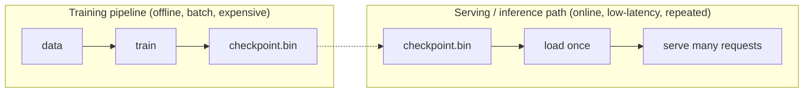

(ch-06)=
# 6. Training vs Inference: Compile-Time Thinking vs Runtime Serving
This mental model will save you more confusion than any other in the book — not about speed, but about memory. The most common misconception isn't performance-related at all: it's assuming a conversation teaches the model something, when in fact nothing but the context window survives past that one inference call; the weights don't change, and the next session starts exactly where the model was before you ever typed a word. Here's that split laid out against a build-and-run cycle you already know cold.

| | Compiling Java | Training a model |
|---|---|---|
| Input | Source code | Labeled data |
| Process | Compiler | Training loop (forward pass, loss, backward pass, optimizer step) |
| Output | Bytecode / `.class` | A weights file (checkpoint) |
| Cost | Seconds to minutes | Hours to months, expensive hardware |
| Happens | Occasionally, during development | Occasionally, when you have new data or want a new capability |

| | Running the JVM | Running inference |
|---|---|---|
| Input | Compiled bytecode + runtime data | Weights file + new input |
| Process | JIT-executed bytecode | Forward pass through the network |
| Output | Program behavior | Predictions / generated text |
| Cost | Milliseconds per request, ideally | Milliseconds to seconds per request |
| Happens | Every request, constantly | Every request, constantly |

Training is a **build step**. Inference is **serving traffic**. Conflating the two is one of the most common early mistakes: people worry about inference latency while accidentally trying to retrain a model on every request, or panic about "the model taking forever" when what's actually slow is a training job that should never have been on the request path in the first place.

This is exactly the shape of a Java build-then-deploy pipeline: `mvn package` happens once per release; the resulting jar handles millions of requests. A model checkpoint is your artifact; loading it into an inference server (`llama.cpp`, `Ollama`, or a JVM-native engine like **Juno**, which loads a GGUF file directly with no Python subprocess) is your deploy step; each chat request afterward is a "runtime" call, not a rebuild.

One nuance that's genuinely new: some systems blur the line by continuing to update weights after initial training in production (**online learning**, or **fine-tuning as you go**: see [Chapters 22–24](#ch-22) on LoRA). Treat that as the exception, not the default. Most systems you'll build will train rarely and infer constantly, exactly like most systems you'll build compile rarely and run constantly.

---

[← Chapter 5: Neural Networks as Layers of Math: Matrices You Already Met in Graphics and Games](#ch-05) &nbsp;|&nbsp; [Table of Contents](../index.md) &nbsp;|&nbsp; [Chapter 7: What Is a Language Model? Tokens, Context Windows, and Why Chat Bots Feel Magical →](#ch-07)
