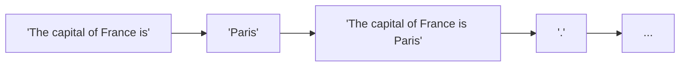
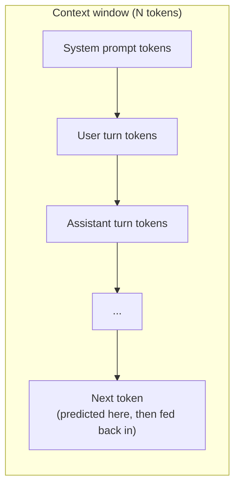

(ch-07)=
# 7. What Is a Language Model? Tokens, Context Windows, and Why Chat Bots Feel Magical
Strip away the mystique and a large language model is a function with an unglamorous job: given a sequence of text, predict what comes next. Nearly every model behind that function today, from the smallest local model to the largest hosted one, is built from the same architecture: the Transformer, introduced by [Vaswani et al. (2017)](../references.md#ref-attention) in the paper whose title says it all, "Attention Is All You Need."

```
predict_next(["The", "capital", "of", "France", "is"]) -> "Paris"
```

Run that function once, append the result, run it again, and you get generation, one piece at a time:



Three vocabulary terms unlock most LLM documentation:

- **Token.** Models don't operate on raw characters or whole words; they operate on **tokens**: sub-word chunks produced by a tokenizer (commonly Byte-Pair Encoding, BPE, adapted for this purpose by [Sennrich, Haddow & Birch, 2016](../references.md#ref-bpe)). "Tokenization" is roughly `String.split()`, but smarter: common words become one token, rare or made-up words get split into pieces (`"unbelievable"` might become `"un"`, `"believ"`, `"able"`). This is why providers bill "per token," not per word or character, because tokens are the model's actual unit of work, and 1,000 English words is typically ~1,300 tokens.
- **Context window.** The maximum number of tokens (input + output combined) the model can "see" at once: its working memory. Think of it as a fixed-size `ArrayDeque` the conversation must fit inside. Once you exceed it, the oldest content is truncated or must be summarized away. A model with a 128K-token context window can hold a genuinely long document; one with 4K cannot hold a support ticket history plus attachments.
- **Chat template.** Raw text generation doesn't inherently know about "user" and "assistant" turns: that structure is imposed by wrapping messages in special marker tokens (`<|user|>`, `<|assistant|>`, etc.) before feeding them to the model. Get the template wrong for a given model family and the model's replies degrade or its trained behaviors (including any fine-tuning) stop being recalled reliably, because this is a real, frequent bug, not a theoretical concern.



The "magic" of a chat bot is this loop: predict one token, append it, repeat, running fast enough and trained on enough text that the emergent behavior looks like reasoning, memory, and conversation. It is neither reasoning nor memory in the way a database or a symbolic AI system has memory; everything the model "knows" mid-conversation is just whatever tokens currently sit inside that context window.

**Further reading:** Vaswani, A. et al. (2017). [Attention Is All You Need](https://arxiv.org/abs/1706.03762). *NeurIPS 2017* · Sennrich, R., Haddow, B., & Birch, A. (2016). [Neural Machine Translation of Rare Words with Subword Units](https://arxiv.org/abs/1508.07909). *ACL 2016*.

---

[← Chapter 6: Training vs Inference: Compile-Time Thinking vs Runtime Serving](#ch-06) &nbsp;|&nbsp; [Table of Contents](../index.md) &nbsp;|&nbsp; [Chapter 8: Why Python Dominates ML. And Why That Shouldn't Trap Your Java Stack →](#ch-08)