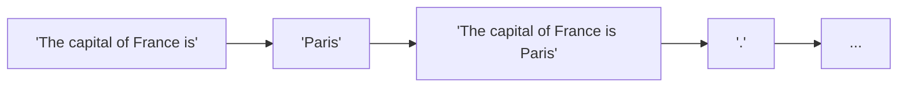
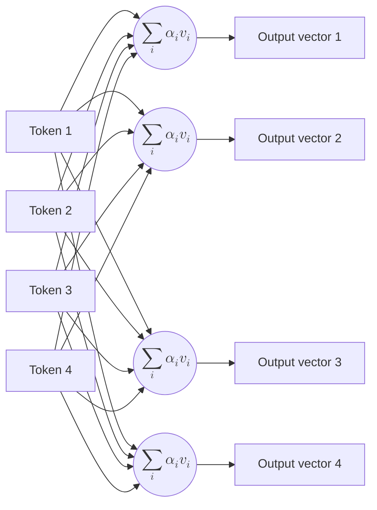
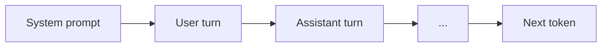
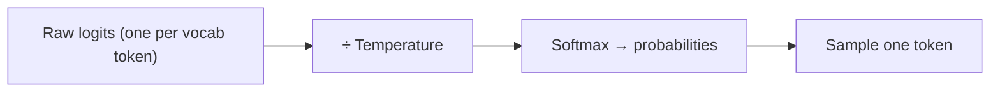

(ch-07)=
# 7. What Is a Language Model? Tokens, Context Windows, and Why Chat Bots Feel Magical

Strip away all the mystique, the large language model is a function with a deceptively simple job: `predicting what comes next given a sequence of text.` Nearly every model in use today, from the smallest locals to the largest hosted models are built on the same architecture: the Transformer, introduced by [Vaswani et al. (2017)](../references.md#ref-attention) in "Attention Is All You Need." No reasoning engine, no grammar rules, no symbolic planner sits underneath any of it. Just one function, called over and over, each time producing a **probability distribution** over the vocabulary, and then sampling one token from it.

```pseudo-code
# Returns a probability distribution, e.g.
# {"Paris": 0.73, "Lyon": 0.04, "Rome": 0.02, "the": 0.01, ...}
dist = predict_next(["The", "capital", "of", "France", "is"])

# A decoding strategy samples/selects one token from the distribution.
sample(dist)  # -> "Paris"
```

Run that function once, append the result, run it again, and you get generation, one token at a time:



**Deep Feedforward Networks** of Deep Learning book.

## What a Token Actually Is

Models do not operate on raw characters or whole words. They operate on **tokens**: sub-word chunks produced by a tokenizer. The standard algorithm today is Byte-Pair Encoding (BPE), introduced for neural machine translation by [Sennrich, Haddow & Birch (2016)](../references.md#ref-bpe). The core idea: start with individual characters as the vocabulary; repeatedly find the most frequent adjacent pair of symbols in the corpus and merge them into a new single token; repeat until the vocabulary reaches a target size (typically 32,000–100,000 entries). The result is a vocabulary that gives common words their own token while splitting rare or invented words into recognizable pieces — without ever needing an explicit "unknown word" fallback.

```
"unbelievable"  →  ["un", "belie", "vable"]	# 3 tokens
"tokenization"  →  ["token", "ization"]    	# 2 tokens
"Juno"          →  ["J", "uno"]            	# 2 tokens
```

Few edge cases we have to consider while integrating with neural network's tokenized data:

**Numbers may tokenize digit by digit.** Some tokenizers, like [Cohere-Command-R](https://docs.cohere.com/docs/tokens-and-tokenizers) can transform `1234` onto `["<BOS_TOKEN>", "1", "2", "3", "4"]` that is 5 separate tokens. `3.14159` becomes eight tokens. The model never sees `1234` as a unit; it sees four symbols that co-occur in certain patterns in training data. This is why LLMs are unreliable at arithmetic: they are not computing - they are predicting which digit tends to follow, based on everything they have seen. There is no calculator in the weights.

**Code tokenizes differently from prose.** Indentation, brackets, underscores, and identifiers like `getUserById` may become `["get", "User", "By", "Id"]`, four tokens for one identifier. JSON, XML, and SQL tend to be token-expensive relative to their information content.

Practical consequence: providers bill per token, not per word. 1,000 English words is typically ~1,300 tokens; code and structured data run higher. Context window limits are in tokens, not characters.

### From string to vector: token IDs and embeddings

The model never processes the string `"Paris"`. The tokenizer maps every token to an integer ID (`"Paris"` might be token `3681`). Those IDs are looked up in an **embedding table**, a matrix of learned floating-point vectors, one row per vocabulary entry, converting the sequence of integers into a sequence of dense vectors the Transformer layers can process.

```
→ input "Paris"
  → token ID "3681"
    → embedding vector [0.23, -0.71, 0.04, ..., 1.12]
                                            ^ for a 7B model size is 4096 floats
```

This is why the weights file is large: the embedding table alone for a 100K-token vocabulary at 4096 dimensions is ~1.6 GB, before the Transformer layers begin.

## The Transformer: Why Attention Changed Everything

Before the Transformer, sequence models processed text left-to-right, one token at a time, carrying a hidden state forward. Long-range dependencies, connecting a pronoun at the end of a paragraph to the noun at its beginning, required that context to survive many sequential steps, which it often did not.

[Vaswani et al. (2017)](../references.md#ref-attention) replaced that sequential bottleneck with **self-attention**: every token in the sequence attends directly to every other token in a single parallel operation. For each position, the model computes a weighted sum over all other positions, where the weights express how relevant each other token is to the current one. Nothing is "far away": `"Paris"` can attend directly to `"capital"` five tokens back or `"France"` fifty tokens back with equal cost!

Crucially, each token position gets its own contextualised output vector. Self-attention is N independent per-position computations running in parallel, not one shared aggregation. Four tokens in means four separate contextualised vectors out.



> *where α is Attention Weight and v is a Value Vector*

**Multi-head attention** runs several attention patterns simultaneously. Each head learning to track different relationships (grammatical subject, coreference, syntactic proximity, topic continuity) then concatenates the results. A full Transformer block is multi-head attention followed by a feed-forward network; these blocks are stacked many times to form the model.

Because self-attention is a set operation with no inherent notion of order, the paper adds **positional encodings** as the vectors that encode each token's position in the sequence, so the model knows that `"France"` at position 4 differs from `"France"` at position 40.

The practical consequence for Java developers: **training is fully parallel over the sequence.** All tokens are processed simultaneously, which is why GPUs (built for parallel matrix operations) accelerate training so dramatically. During inference, however, generation is still sequential: token 10 cannot be predicted until tokens 1–9 exist, because each new token is fed back in as the next input.

## The Context Window

The context window is the maximum number of tokens, inputs plus outputs combined, the model processes at once. It is strict working memory with a hard cap.



Three elements in this diagram worth unpacking explicitly:

**System prompt** - instructions prepended to every call: persona, output format, constraints, fixed context (today's date, the user's role). It is re-sent on every request and counts against the token budget every time. It is invisible to the end user but always the first thing the model reads.

**Conversation history** - the model has no persistent memory between API calls. The client is responsible for resending the full transcript on every turn. Close the session and the weights are unchanged; what looked like memory was entirely the tokens being resent.

**Silent truncation** - when the window fills, content is cut without error. The model does not tell you it has forgotten the beginning of the document. This is the most common silent failure mode in production systems built on long context.

**Chat template.** Raw token prediction has no built-in concept of "user" and "assistant" turns; that structure is imposed by wrapping messages in special marker tokens (`<|user|>`, `<|assistant|>`, `<|system|>`, etc.) defined per model family. Use the wrong template and the model's trained behaviors degrade: a frequent real bug when switching model families while reusing wrong marker codesS.

## Temperature and Sampling: Why the Same Prompt Gives Different Answers

The model produces a probability distribution over the entire vocabulary on every step. **Greedy decoding** always picks the highest-probability token; every real chat system samples instead, which introduces controlled randomness.

**Temperature** scales the raw output scores (logits) before the softmax converts them to probabilities:



- **Temperature = 0** - peaks sharpen; the model almost always picks its top token. Deterministic and consistent, but repetitive and formulaic.
- **Temperature = 1.0** - the distribution as learned during training; moderate variability.
- **Temperature > 1** - the distribution flattens; lower-probability tokens get more weight. More surprising outputs, more likely to hallucinate.

**Top-k** restricts sampling to the k highest-probability tokens; **top-p** (nucleus sampling), introduced by [Holtzman et al. (2020)](../references.md#ref-nucleus), keeps only the smallest set of tokens whose cumulative probability reaches p - typically 0.9 or 0.95. Both prevent sampling from the long improbable tail while preserving useful diversity. Most production APIs expose all three parameters.

Practical defaults: temperature 0 or near-zero for deterministic tasks (structured data extraction, code generation); 0.7–1.0 for open-ended generation. Running the same prompt several times at temperature 1 and measuring output variance is a fast proxy for how confident the model actually is about a given question.

## The Generation Loop: Where the "Magic" Lives

Put it all together: tokenize the input, look up embeddings, run the Transformer, produce a probability distribution, sample one token, append it to the sequence, feed the extended sequence back in, repeat. The "magic" of a chat bot is this loop, running at tens to hundreds of tokens per second, trained on enough text that the emergent behavior resembles reasoning, memory, and understanding.

It is none of those things in the way a database or symbolic AI system has them. There is no planner, no knowledge graph, no memory store. Everything the model "knows" mid-conversation is whatever tokens currently sit in the context window, plus the statistical patterns the Transformer weights absorbed during pretraining on billions of tokens of human text. The model learned what tends to follow what, at massive scale. That turns out to be surprisingly close to useful.

**Further reading:**
- Vaswani, A. et al. (2017). [Attention Is All You Need](https://arxiv.org/abs/1706.03762). *NeurIPS 2017* - replaced sequential recurrence with parallel self-attention. The key insight: instead of carrying context through a bottleneck hidden state, let every token attend directly to every other token in one matrix operation. Multi-head attention, positional encoding, and the encoder-decoder stack introduced here are the direct ancestors of every modern LLM.
- Sennrich, R., Haddow, B., & Birch, A. (2016). [Neural Machine Translation of Rare Words with Subword Units](https://arxiv.org/abs/1508.07909). *ACL 2016* - the BPE paper. Core insight: you do not need a fixed word vocabulary with an "unknown" fallback; instead, iteratively merge the most frequent character pairs until the vocabulary reaches a target size. Common words get a single token; rare or invented words decompose into recognizable pieces. Every tokenizer in use today is a direct descendant.
- Holtzman, A. et al. (2020). [The Curious Case of Neural Text Degeneration](https://arxiv.org/abs/1904.09751). *ICLR 2020* - introduces nucleus (top-p) sampling and demonstrates why greedy and beam-search decoding produce degenerate, repetitive output despite picking "the best" tokens at each step. The paper that made temperature + top-p the default in every production API.
- Goodfellow, I., Bengio, Y., & Courville, A. (2016). [Deep Learning](https://www.deeplearningbook.org/contents/mlp.html). MIT Press - for readers who want the layer-wise mathematics (weight matrices, activation functions, forward propagation) treated rigorously in a textbook setting. The *Deep Feedforward Networks* chapter covers the building blocks shared by Transformer FFN sublayers and the embedding lookup. Note: the book was published in 2016, a year before the Transformer; self-attention is not covered, but the feedforward and linear-algebra foundations apply directly.
---

[← Chapter 6: Training vs Inference: Compile-Time Thinking vs Runtime Serving](#ch-06) &nbsp;|&nbsp; [Table of Contents](../index.md) &nbsp;|&nbsp; [Chapter 8: Why Python Dominates ML. And Why That Shouldn't Trap Your Java Stack →](#ch-08)
