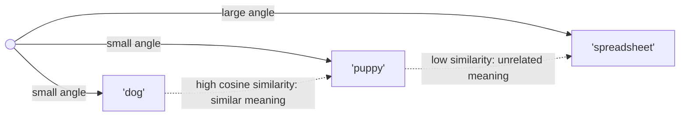

(ch-09)=
# 9. Vectors and Similarity, Not Just Embeddings: Cosine, Dot Product, and Why "Closeness" Works
Before [Chapter 10](#ch-10) introduces embeddings properly, you need one geometric idea: numbers arranged as a vector can represent *meaning*, and the distance between two vectors can represent *similarity of meaning*.

A vector here is just what it is in any graphics or physics code you've written: an ordered array of numbers, `double[]` or `float[]`, but instead of representing a position in 3D space, it represents a position in a space with hundreds or thousands of dimensions, where "nearby" means "semantically similar."

Two standard ways to measure "nearby":

**Dot product**: multiply corresponding elements and sum:

```java
double dot(double[] a, double[] b) {
    double sum = 0;
    for (int i = 0; i < a.length; i++) sum += a[i] * b[i];
    return sum;
}
```

**Cosine similarity**: the dot product normalized by each vector's length, so it measures the *angle* between vectors, ignoring their magnitude:

```java
double cosineSimilarity(double[] a, double[] b) {
    double dot = dot(a, b), normA = 0, normB = 0;
    for (int i = 0; i < a.length; i++) { normA += a[i]*a[i]; normB += b[i]*b[i]; }
    return dot / (Math.sqrt(normA) * Math.sqrt(normB));
}
```

Cosine similarity returns a value from -1 (opposite meaning) to 1 (identical direction, i.e. same meaning), with 0 meaning unrelated. It's the default choice for text similarity because it cares about *direction* (what the text is about) rather than *magnitude* (how long the text is).



Why should this work at all? Why would "meaning" correspond to geometric direction? Because these vectors (called **embeddings**, covered fully next chapter) are *trained* so that words and sentences used in similar contexts end up pointing in similar directions, an empirical finding first demonstrated at scale by [Mikolov et al. (2013)](../references.md#ref-word2vec) with word2vec. It's an emergent property of training on massive text, not something anyone hand-designed, much like how a hash function is designed to scatter similar-looking inputs apart, an embedding model is trained to cluster similar-*meaning* inputs together.

This one idea, turning things into vectors and measuring closeness with cosine or dot product, is the mathematical foundation underneath semantic search, recommendation systems, RAG ([Chapter 18](#ch-18)), and vector databases ([Chapter 11](#ch-11)). Once it clicks, a large fraction of "AI-powered search" products stop looking like magic and start looking like an indexing problem you already know how to reason about.

**Further reading:** Mikolov, T., Chen, K., Corrado, G., & Dean, J. (2013). [Efficient Estimation of Word Representations in Vector Space](https://arxiv.org/abs/1301.3781). arXiv:1301.3781 — the word2vec paper establishing that training on context produces geometrically meaningful embeddings.

---

[← Chapter 8: Why Python Dominates ML. And Why That Shouldn't Trap Your Java Stack](#ch-08) &nbsp;|&nbsp; [Table of Contents](../index.md) &nbsp;|&nbsp; [Chapter 10: Embeddings 101: Turning Text into Vectors Your Services Can Search →](#ch-10)