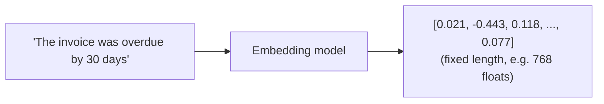

(ch-10)=
# 10. Embeddings 101: Turning Text into Vectors Your Services Can Search
An **embedding** is the output of feeding text into a specialized model whose only job is to compress meaning into a fixed-length vector, typically 384 to 4096 numbers (`float[]`), regardless of whether the input was one word or three paragraphs.



Two texts with similar meaning produce vectors that are close together by cosine similarity ([Chapter 9](#ch-09)), even if they don't share a single word:

```
embed("late payment")        ~ [0.019, -0.440, 0.121, ...]   -- close to "overdue invoice"
embed("cute puppy photos")   ~ [-0.512, 0.077, -0.301, ...]  -- far away
```

This is the key capability that unlocks **semantic search**: instead of matching keywords (`LIKE '%overdue%'`), you match *meaning*. A support ticket search for "customer wants a refund" can surface a ticket that says "asking for money back": zero shared keywords, high semantic similarity.

From a Java engineering point of view, treat an embedding model as a pure function you call once per document at ingestion time, and once per query at search time:

```java
float[] docVector   = embeddingClient.embed(document.text());
float[] queryVector = embeddingClient.embed(userQuery);
double score = cosineSimilarity(queryVector, docVector);
```

You can get embeddings from a hosted API, from a local model served by **llama.cpp** or **Ollama** (`ollama run` supports dedicated embedding models like `nomic-embed-text`), or in-process, since Juno's `JunoPlayer.embed(messages)` returns the model's last hidden state as a `float[]` with no separate embedding model or network call required, reusing the same GGUF that also does chat.

A frequent beginner mistake: comparing embeddings from *two different models*. Embedding spaces are not universal coordinate systems, because model A's vector for "dog" and model B's vector for "dog" live in unrelated spaces, the way two different hash functions produce unrelated hashes for the same input. Always embed queries and documents with the *same* model, and re-embed everything if you ever switch models.

Practical sizing note: embedding 10,000 support tickets is a batch job, not a request-path operation: treat it like building a search index, because that's exactly what it is (see [Chapter 11](#ch-11)).

---

[← Chapter 9: Vectors and Similarity, Not Just Embeddings: Cosine, Dot Product, and Why "Closeness" Works](#ch-09) &nbsp;|&nbsp; [Table of Contents](../index.md) &nbsp;|&nbsp; [Chapter 11: Vector Databases and ANN Indexes: HNSW for People Who Think in B-Trees →](#ch-11)
