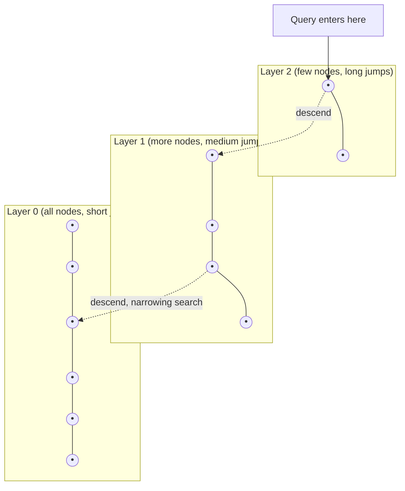

(ch-11)=
# 11. Vector Databases and ANN Indexes: HNSW for People Who Think in B-Trees
You already know why a `B-tree` index beats a full table scan: it lets the database skip most rows instead of comparing against every one. Vector search has the identical problem and the identical motivation for an index, except the query isn't "find rows where `id = 42`," it's "find the K vectors closest to this vector," and there's no natural ordering to build a B-tree on.

**Brute-force** vector search is a full scan: compute cosine similarity against every stored vector, sort, take the top K. Correct, and fine up to maybe tens of thousands of vectors. Beyond that, it doesn't scale, because it's O(N) per query, always.

**Approximate Nearest Neighbor (ANN)** indexes trade a small amount of accuracy for a huge amount of speed, the same bargain a probabilistic data structure like a Bloom filter makes. The dominant algorithm today is **HNSW** (Hierarchical Navigable Small World), introduced by [Malkov & Yashunin (2018)](../references.md#ref-hnsw).

The intuition: HNSW builds several layers of a graph connecting vectors to their approximate neighbors, coarsest layer on top:

Search starts at the sparse top layer, greedily walks toward the query vector, then drops down a layer and repeats with finer granularity, much like how a B-tree walks from a coarse root node down to a precise leaf, except HNSW's "tree" is a graph with fuzzy, probabilistic shortcuts instead of exact sorted keys.

| Concept you know | Vector search equivalent |
|---|---|
| B-tree index | HNSW / IVF index |
| `WHERE id = 42` (exact match) | `ORDER BY distance LIMIT K` (nearest neighbor) |
| Full table scan | Brute-force vector scan |
| Index build time vs. query time trade-off | Same trade-off, plus a *recall* dial (accuracy vs. speed) |

Vector databases (Pinecone, Weaviate, Qdrant, pgvector as a Postgres extension) wrap an ANN index with the CRUD, filtering, and persistence layer you'd expect from any datastore. `pgvector` deserves a special mention for Java teams: if you already run Postgres, adding a `vector` column and an HNSW index (`CREATE INDEX ... USING hnsw (embedding vector_cosine_ops)`) may be less operational overhead than standing up a dedicated vector database, at least until your scale genuinely demands it.

One practical knob every ANN index exposes: **recall vs. latency.** Tuning HNSW's `ef_search` parameter higher gives more accurate nearest-neighbor results at the cost of slower queries, conceptually identical to trading index selectivity for query planner cost in a relational database.

**Further reading:** Malkov, Y. A., & Yashunin, D. A. (2018). [Efficient and Robust Approximate Nearest Neighbor Search Using Hierarchical Navigable Small World Graphs](https://arxiv.org/abs/1603.09320). *IEEE TPAMI*, 42(4), 824–836.

---

[← Chapter 10: Embeddings 101: Turning Text into Vectors Your Services Can Search](#ch-10) &nbsp;|&nbsp; [Table of Contents](../index.md) &nbsp;|&nbsp; [Chapter 12: Prompt Engineering for Engineers: Specs, Contracts, and Failure Modes →](#ch-12)