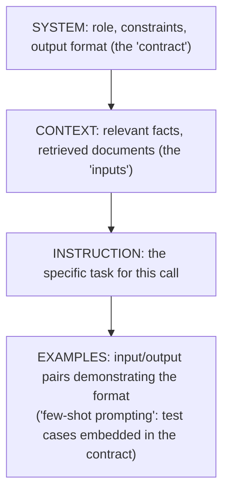

(ch-12)=
# 12. Prompt Engineering for Engineers: Specs, Contracts, and Failure Modes
Stop thinking of a prompt as "a question." Think of it as **an API contract you're writing for a very literal, very inconsistent implementer.** The discipline that makes you good at writing clear method contracts (preconditions, postconditions, examples in Javadoc) is the same discipline that makes you good at prompting.

A prompt has structural components worth treating separately, the way you'd separate a method signature from its Javadoc from its unit tests:



Concrete before/after:

```
Bad:  "Summarize this ticket."

Good: "You are a support-ticket summarizer. Output exactly 2 sentences,
       plain text, no markdown. If the ticket mentions a refund amount,
       state it in the first sentence.

       Example:
       Ticket: 'App crashes on launch since v2.3, want my $9.99 back.'
       Summary: 'Customer reports a crash on launch since v2.3 and is
       requesting a $9.99 refund. No troubleshooting attempted yet.'

       Ticket: {{ticket_text}}
       Summary:"
```

The "good" version works better for the same reason a well-specified Javadoc reduces bugs: it removes ambiguity about the *shape* of the expected answer, not just its content.

**Common failure modes** worth naming explicitly, because recognizing them is most of the battle when debugging a prompt that isn't working:

- **Underspecification**: the model fills gaps with plausible-sounding guesses (this is a major source of hallucination, see [Chapter 20](#ch-20)). If you don't specify the output format, you'll get a different format every time.
- **Instruction dilution**: burying the actual instruction in a wall of context. Put the task instruction close to where the model will generate, often *after* the context, not just before it.
- **Contradictory constraints**: "be concise" and "explain your full reasoning" in the same prompt produce inconsistent behavior, the same way contradictory preconditions produce undefined behavior in code.
- **Format drift over long conversations**: the model's early careful formatting decays as more turns fill the context window. Repeating the format constraint periodically, or moving it into a system prompt honored every turn, mitigates this.

A useful engineering habit: treat your prompts as **versioned artifacts** with test cases, not throwaway strings inlined in application code. [Chapter 21](#ch-21) and [Chapter 33](#ch-33) build directly on this idea.

---

[← Chapter 11: Vector Databases and ANN Indexes: HNSW for People Who Think in B-Trees](#ch-11) &nbsp;|&nbsp; [Table of Contents](../index.md) &nbsp;|&nbsp; [Chapter 13: Structured Output: JSON Schema, Constrained Decoding, and Why "Just Ask Nicely" Fails →](#ch-13)
