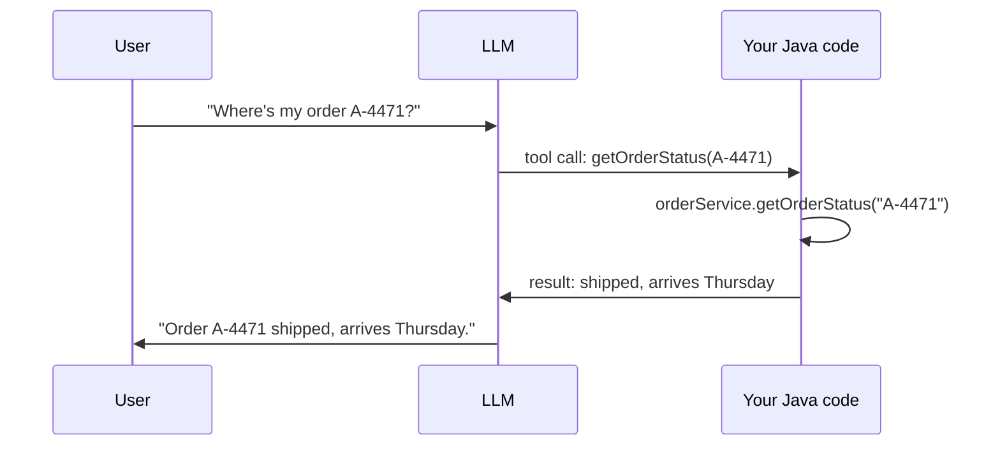

(ch-15)=
# 15. Function Calling and Tool Use: Letting the Model Call Your Java Methods
An LLM cannot query your database, check today's weather, or call a REST API: it can only generate text. **Function calling** (also called tool use) is the pattern that bridges this gap, and it's simpler than it sounds once you see it as structured output ([Chapter 13](#ch-13)) applied to a specific purpose. The idea was formalized in two influential 2023 papers: [Schick et al.'s Toolformer](../references.md#ref-toolformer), which taught a model to decide for itself when to call an API, and [Yao et al.'s ReAct](../references.md#ref-react), which interleaves reasoning steps with tool calls.

The flow, step by step:

```
1. You send the model a prompt PLUS a list of available "tools": each one
   described like a method signature: name, parameters, types, description.

2. Instead of a plain text reply, the model may emit a structured request:
   { "tool": "getOrderStatus", "arguments": { "orderId": "A-4471" } }

3. Your Java code recognizes this, actually calls the real method:
   orderService.getOrderStatus("A-4471")

4. You send the function's return value back to the model as new context.

5. The model incorporates the real data into its final natural-language reply:
   "Your order A-4471 shipped yesterday and should arrive Thursday."
```



The model never executes anything itself: it only ever generates a *description* of a call, formatted as structured output (usually JSON) matching a schema you supplied. All the actual execution, security boundaries, and error handling stay exactly where you'd expect them: in your own code.

```java
record ToolCall(String name, Map<String, Object> arguments) {}

Object dispatch(ToolCall call) {
    return switch (call.name()) {
        case "getOrderStatus" -> orderService.getOrderStatus((String) call.arguments().get("orderId"));
        case "getWeather"     -> weatherService.get((String) call.arguments().get("city"));
        default -> throw new IllegalArgumentException("Unknown tool: " + call.name());
    };
}
```

This is, structurally, a **remote procedure call where the caller is a probabilistic model deciding *whether* and *how* to call, not a strongly-typed client stub.** That distinction is exactly why validation matters more here than in a normal RPC: never trust the model's arguments blindly. Validate types, ranges, and, critically, authorization, exactly as you would for any input arriving over an untrusted network boundary (this connects directly to [Chapter 19](#ch-19), prompt injection, since a compromised prompt could try to coax the model into calling a tool it shouldn't, or with attacker-chosen arguments).

Tool support is now standard across serving layers: OpenAI-compatible APIs (which both llama.cpp's server and Ollama implement) expose a `tools` field in chat completion requests using this same call-and-return shape, so a Java client written against one backend generally works unchanged against another.

**Further reading:** Schick, T. et al. (2023). [Toolformer: Language Models Can Teach Themselves to Use Tools](https://arxiv.org/abs/2302.04761). *NeurIPS 2023* · Yao, S. et al. (2023). [ReAct: Synergizing Reasoning and Acting in Language Models](https://arxiv.org/abs/2210.03629). *ICLR 2023*.

---

[← Chapter 14: Temperature, Top-P, Top-K: Sampling Knobs That Change Model Personality](#ch-14) &nbsp;|&nbsp; [Table of Contents](../index.md) &nbsp;|&nbsp; [Chapter 16: GGUF and Quantization: How Big Models Fit on Ordinary Hardware →](#ch-16)
