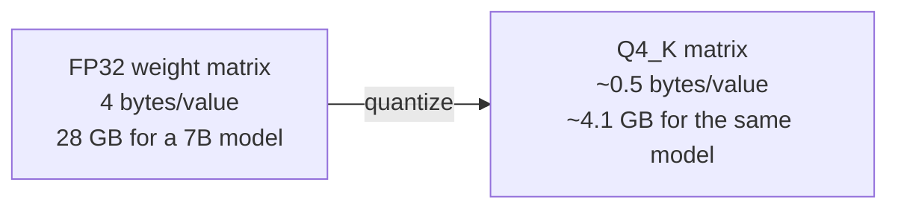

(ch-16)=
# 16. GGUF and Quantization: How Big Models Fit on Ordinary Hardware
A model's weights are, at full precision, stored as 32-bit floating point numbers (FP32): 4 bytes each. A 7-billion-parameter model at FP32 needs roughly 28 GB just to hold the weights in memory, before you've generated a single token. That rules out most laptops and even a lot of server hardware.

**Quantization** is the practice of storing weights at lower precision, fewer bits per number, accepting a small accuracy loss in exchange for a large reduction in memory footprint and often faster inference (moving fewer bytes per matrix multiplication). It's conceptually close to choosing `short` over `int` when you know the value range never needs 32 bits, except here the "value range" is a statistical distribution of trained weights, not a known integer bound, so quantization schemes have to be smarter than a simple type downcast. One influential, widely-adopted approach along these lines is GPTQ, a one-shot post-training quantization method introduced by [Frantar et al. (2022)](../references.md#ref-gptq); GGUF's own k-quant scheme is a distinct, related family of techniques rather than GPTQ itself, but they share the same underlying trade-off.

**GGUF** is the file format that packages a model's architecture metadata, tokenizer, and quantized (or full-precision) weight tensors into one portable, self-describing file: the `.gguf` extension you'll see constantly across llama.cpp, Ollama, and Juno. It's the closest thing this ecosystem has to a "fat jar": one file, everything needed to run it, no separate config or tokenizer files to lose track of.

Common quantization levels you'll encounter (roughly smallest/lowest-fidelity to largest/highest-fidelity):

| Format | Bits/weight (approx.) | Typical use |
|---|---|---|
| `Q2_K` | ~2.5 | Extreme compression, noticeable quality loss |
| `Q4_0` / `Q4_K` | ~4-4.5 | The common sweet spot: small, usually still coherent |
| `Q5_K` | ~5.5 | Better fidelity, still meaningfully smaller than full precision |
| `Q8_0` | ~8.5 | Near full-precision quality, still ~4x smaller than FP32 |
| `F16` / `BF16` | 16 | Half precision, common training/inference default |
| `F32` | 32 | Full precision, rarely needed for inference |

The `_K` suffix (e.g. `Q4_K_M`) denotes "k-quants": instead of a single scale factor for an entire weight matrix, the matrix is split into small blocks (commonly 256 elements) each with its own scale factor, which recovers much of the accuracy lost by naive uniform quantization, a form of adaptive precision, similar in spirit to floating point itself trading exponent range for mantissa precision depending on magnitude.

Practically: a TinyLlama 1.1B model at `Q4_K_M` needs roughly 637 MB and runs comfortably in a couple gigabytes of heap; a 7B Mistral at the same quantization needs roughly 4.1 GB. This is *why* quantized GGUF became the default distribution format for local and edge inference: it turns "needs a data-center GPU" into "runs on a developer laptop's CPU," at the cost of some precision that, at `Q4_K_M` and above, is usually indistinguishable from full precision for everyday use.

One consequence worth knowing for later chapters: the numerical "noise" introduced by quantization (on the order of ~3×10⁻³ per element at Q4_K) turns out to matter a great deal when you fine-tune and then try to re-quantize the result: [Chapter 25](#ch-25) covers exactly why.

**Further reading:** Frantar, E., Ashkboos, S., Hoefler, T., & Alistarh, D. (2022). [GPTQ: Accurate Post-Training Quantization for Generative Pre-trained Transformers](https://arxiv.org/abs/2210.17323). arXiv:2210.17323.

---

[← Chapter 15: Function Calling and Tool Use: Letting the Model Call Your Java Methods](#ch-15) &nbsp;|&nbsp; [Table of Contents](../index.md) &nbsp;|&nbsp; [Chapter 17: OpenAI-Compatible APIs: One Client Interface, Many Backends →](#ch-17)
