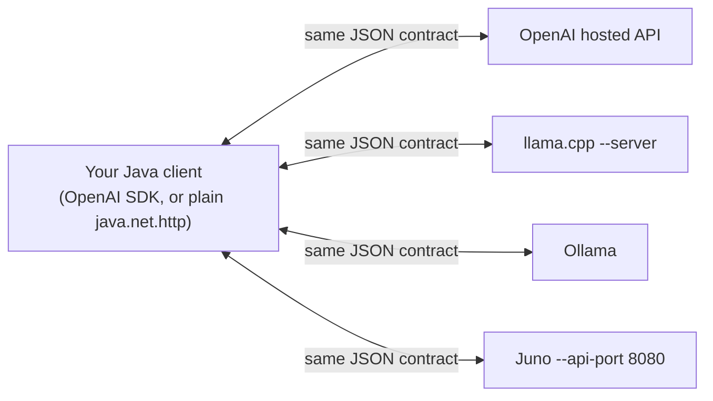

(ch-17)=
# 17. OpenAI-Compatible APIs: One Client Interface, Many Backends
One of the more Java-friendly things to happen in this ecosystem is the informal standardization around OpenAI's Chat Completions wire format: `POST /v1/chat/completions`, a JSON body with `model`, `messages`, `temperature`, and friends, and a JSON (or Server-Sent Events, for streaming) response.

The genuinely useful part: **this is now an interface, not a vendor.** Multiple independent backends implement the same wire contract:

- OpenAI's own hosted API.
- **llama.cpp**'s server mode (`llama-server`).
- **Ollama** (which wraps llama.cpp with model management ergonomics).
- **Juno**'s coordinator, when started with `--api-port`: `OpenAiChatHandler` translates the OpenAI JSON shape to and from Juno's internal `InferenceRequest`/`GenerationResult` types with, notably, zero changes required to the underlying generation loop, scheduler, or sampler; it's a pure translation shim sitting above the same request path Juno's native API uses.


*(swap `base_url` only: no code changes, no adapter library)*

This is the same value proposition as JDBC: your application code targets one interface, and the concrete implementation, which vendor, which driver, is a connection-string-level decision, not an application-rewrite-level decision. Switching from a hosted API to a self-hosted GGUF model on your own hardware should, ideally, mean changing a base URL and nothing else.

In practice, backends differ slightly outside the core contract: model naming conventions, which optional fields they honor versus silently ignore (`seed`, `logit_bias`, and `presence_penalty` are commonly accepted-but-ignored for compatibility rather than actually implemented), and vendor-specific extensions layered on top with a namespaced prefix so they don't collide with the standard fields (Juno's `x_juno_session_id` for stable KV-cache reuse across turns, `x_juno_priority` for request scheduling, and `x_juno_top_k` are examples of this pattern). Design your client code against the documented common subset, and treat vendor extensions as optional, additive capabilities rather than requirements, the same discipline you'd apply to any API you don't fully control.

```java
var request = HttpRequest.newBuilder(URI.create(baseUrl + "/v1/chat/completions"))
    .header("Content-Type", "application/json")
    .POST(HttpRequest.BodyPublishers.ofString(requestJson))
    .build();
// baseUrl is the only thing that changes between OpenAI, llama.cpp, Ollama, or Juno
```

**Further reading:** OpenAI. [Chat Completions API reference](https://platform.openai.com/docs/api-reference/chat) — the de facto wire-format standard this chapter is built around.

---

[← Chapter 16: GGUF and Quantization: How Big Models Fit on Ordinary Hardware](#ch-16) &nbsp;|&nbsp; [Table of Contents](../index.md) &nbsp;|&nbsp; [Chapter 18: RAG for Java Teams: Retrieve Documents, Then Ask the Model →](#ch-18)