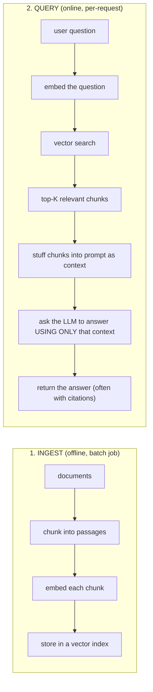
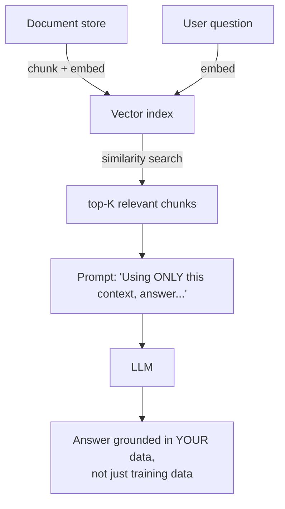

(ch-18)=
# 18. RAG for Java Teams: Retrieve Documents, Then Ask the Model
**Retrieval-Augmented Generation (RAG)**, a term coined by [Lewis et al. (2020)](../references.md#ref-rag), solves a very concrete problem: a model's knowledge is frozen at training time and limited to what it happened to see, but your users need answers grounded in your company's current, private documents: support tickets, internal wikis, product specs the model was never trained on and never will be.

The pattern is almost aggressively simple once you strip the buzzword away, and it composes directly from [Chapters 9–11](#ch-09):





This is, structurally, the same shape as a search-then-render web application: you're building a retrieval pipeline ([Chapter 11](#ch-11)'s job) and a rendering step, except the "rendering" is an LLM synthesizing a fluent answer from retrieved passages instead of a template engine populating HTML. If you've built faceted search before, you already understand most of the plumbing; the new part is the prompt-construction step and the final generation call.

A minimal Java sketch:

```java
List<Chunk> relevant = vectorStore.search(embed(userQuestion), 5);
String context = relevant.stream().map(Chunk::text).collect(Collectors.joining("\n\n"));
String prompt = """
    Answer the question using ONLY the context below. If the answer isn't
    in the context, say you don't know.

    Context:
    %s

    Question: %s
    """.formatted(context, userQuestion);
String answer = llmClient.chat(prompt);
```

Why RAG beats "just fine-tune the model on our docs" for most knowledge-freshness problems (see [Chapter 22](#ch-22) for the fuller comparison): retrieval indexes update the moment a document changes: no retraining, no redeployment, and the model's answer is explicitly grounded in retrieved text you can show the user as a citation, which is both a trust feature and a debugging feature: when the answer is wrong, you can inspect exactly which passages it was given.

RAG does not eliminate hallucination (a model can still misread or ignore the provided context), but it substantially reduces it by giving the model the actual answer to paraphrase instead of asking it to recall from parametric memory. [Chapter 20](#ch-20) covers what still has to be your application's responsibility on top of RAG.

**Further reading:** Lewis, P. et al. (2020). [Retrieval-Augmented Generation for Knowledge-Intensive NLP Tasks](https://arxiv.org/abs/2005.11401). *NeurIPS 2020*.

---

[← Chapter 17: OpenAI-Compatible APIs: One Client Interface, Many Backends](#ch-17) &nbsp;|&nbsp; [Table of Contents](../index.md) &nbsp;|&nbsp; [Chapter 19: Prompt Injection: The SQL Injection of the LLM Era →](#ch-19)