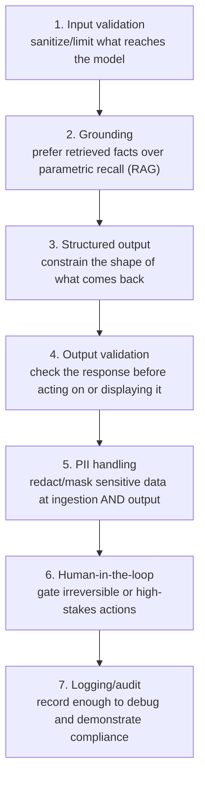

(ch-20)=
# 20. Safety and Guardrails: Hallucinations, PII, and What Your App Must Own
A **hallucination** is a model generating a confident, fluent, plausible-sounding answer that is factually wrong — a phenomenon comprehensively surveyed by [Ji et al. (2023)](../references.md#ref-hallucination) across natural language generation systems generally, not just chat models. It is not a bug in the traditional sense, but an inherent consequence of how the model works: it's predicting statistically likely *text*, not looking up verified *facts*. Nothing in the base architecture distinguishes "I recall this precisely" from "this pattern completes plausibly." A model with no access to a real database will confidently invent a plausible-looking order number if asked for one, because a plausible-looking order number is exactly what its training taught it to produce next.

This is a fundamental property, not a temporary limitation soon to be patched away, which means the responsibility for managing it sits squarely with the application layer, not something you can prompt your way entirely out of:

| Responsibility | Who owns it |
|---|---|
| Reducing *opportunity* for hallucination on factual questions | You: ground answers in retrieved data (RAG, [Chapter 18](#ch-18)) rather than relying on parametric memory |
| Constraining output *format* so downstream code can validate it | You: structured output / constrained decoding ([Chapter 13](#ch-13)) |
| Detecting when the model expresses (or should express) uncertainty | You: the model itself won't reliably self-flag low confidence |
| Final fact-check before high-stakes action | You: never let raw model output directly trigger an irreversible action (a refund, a database write, an email send) without a validation or approval layer |

**PII (Personally Identifiable Information) handling** is a second, distinct concern. A model that was trained on data containing PII may reproduce it; more commonly and more practically, a model *given* PII in its context (a support ticket with a customer's address, a chat log with a credit card fragment) will happily echo it back, log it, or forward it to wherever its output goes next, because it has no innate concept of "sensitive," only patterns in text. If your pipeline sends model output onward (into logs, into another API, into a training dataset for fine-tuning, see [Chapter 23](#ch-23)), PII redaction has to happen at the application boundary, the same way it would for any other data pipeline handling regulated data. The model is not a trust boundary.

A practical layered checklist for a production LLM feature, roughly in execution order:

None of this is exotic if you've built any system that handles untrusted input and produces consequential output before: it's the same discipline applied to a new kind of unreliable component. The mistake to avoid is treating the model's fluency as a proxy for its reliability; they are unrelated properties, and a model can be extremely fluent while being extremely wrong.

**Further reading:** Ji, Z. et al. (2023). [Survey of Hallucination in Natural Language Generation](https://arxiv.org/abs/2202.03629). *ACM Computing Surveys*, 55(12), Article 248.

---

[← Chapter 19: Prompt Injection: The SQL Injection of the LLM Era](#ch-19) &nbsp;|&nbsp; [Table of Contents](../index.md) &nbsp;|&nbsp; [Chapter 21: Evaluating LLM Output: Why Unit Tests Don't Work and What Replaces Them →](#ch-21)