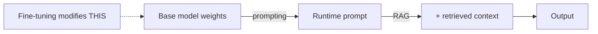

(ch-22)=
# 22. Fine-Tuning vs Prompting vs RAG: Choosing the Right Lever
Three distinct levers exist for making a general-purpose model behave the way your product needs, and picking the wrong one wastes weeks. Think of them as three different places to intervene in the pipeline from [Chapter 6](#ch-06):

- **Prompting** ([Chapters 12–14](#ch-12)) changes *nothing* about the model: it's the cheapest, fastest, most reversible lever. Use it for: instructing tone/format, providing a few examples, giving task-specific instructions. Ceiling: it can't teach the model facts or skills it fundamentally doesn't have, and it re-spends context-window tokens (and money) on every single request.
- **RAG** ([Chapter 18](#ch-18)) doesn't change the model either: it changes what facts are *available* to reference at request time. Use it for: knowledge that changes frequently, needs to be attributable/citable, or is too large to ever fit in a prompt. Ceiling: it doesn't change *how* the model behaves, reasons, or writes, only what facts it can draw on.
- **Fine-tuning** (LoRA: [Chapters 23–24](#ch-23)) actually modifies the model's weights, teaching it a *behavior* or *style* durably, without needing to re-supply examples in every prompt. Use it for: consistent tone/persona, a specialized output format the model should produce by default, domain-specific reasoning patterns, or recalling a small set of durable facts without RAG's retrieval-then-inject overhead on every call. Ceiling: it's the most operationally expensive lever (requires training data, compute, evaluation, and a deployment step for the new weights), and it's a poor fit for facts that change often, because you'd be retraining constantly.

| Question | If yes, lean toward... |
|---|---|
| Does the answer need to cite a specific, current source? | RAG |
| Is this a one-off instruction or format tweak? | Prompting |
| Does the *knowledge* change weekly or daily? | RAG (retraining that often is impractical) |
| Does the model need to durably *behave* differently (tone, structure, domain reasoning) on every call? | Fine-tuning |
| Are you trying to shrink a large, expensive prompt full of instructions into a smaller, cheaper default behavior? | Fine-tuning |
| Do you have (or can you build) a labeled dataset of the target behavior? | Fine-tuning (prerequisite, see [Chapter 23](#ch-23)) |

In practice these compose, not compete. A production support-bot commonly layers all three: a fine-tuned adapter for consistent tone and ticket-summary format ([Chapter 24](#ch-24)), RAG for pulling in the current product documentation ([Chapter 18](#ch-18)), and a well-engineered system prompt for task-specific instructions ([Chapter 12](#ch-12)), the same way a production application layers caching, indexing, and query optimization rather than picking exactly one performance technique.

The single most common mistake: reaching for fine-tuning to solve a knowledge-freshness problem RAG would solve more cheaply and more maintainably, or reaching for RAG to fix a *style* problem that a small, well-targeted fine-tune would fix more durably and more cheaply per request.

---

[← Chapter 21: Evaluating LLM Output: Why Unit Tests Don't Work and What Replaces Them](#ch-21) &nbsp;|&nbsp; [Table of Contents](../index.md) &nbsp;|&nbsp; [Chapter 23: Preparing a Fine-Tuning Dataset: From Logs and Tickets to Training Pairs →](#ch-23)
