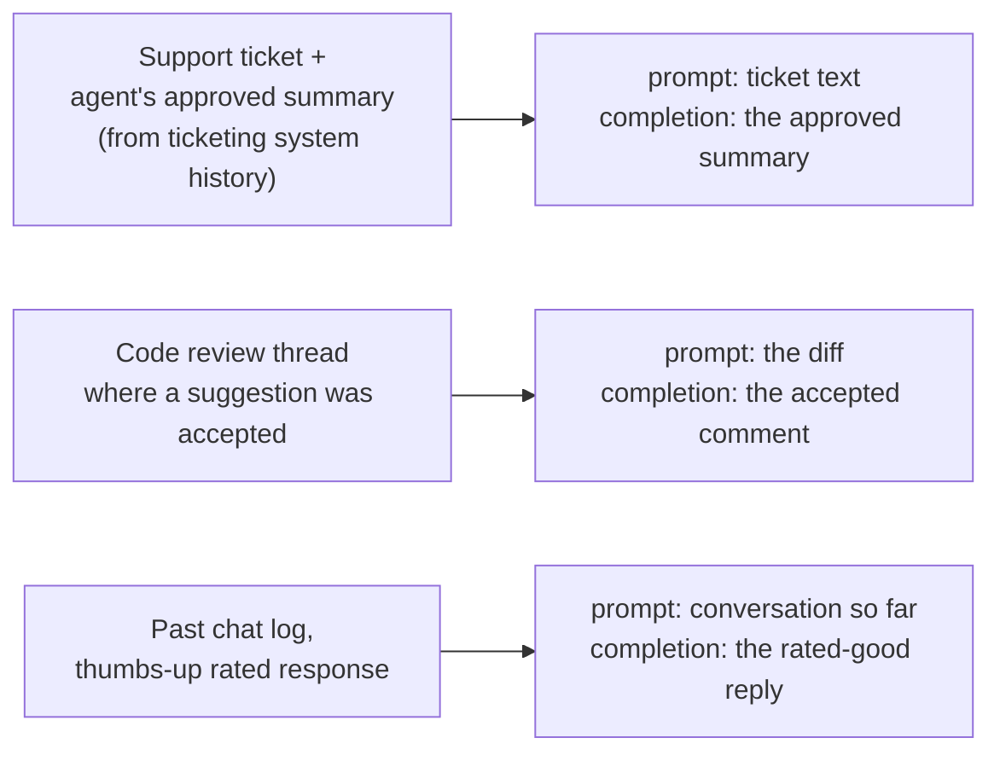

(ch-23)=
# 23. Preparing a Fine-Tuning Dataset: From Logs and Tickets to Training Pairs
Fine-tuning data is, structurally, exactly the `List<TrainingExample>` from [Chapter 3](#ch-03), specialized to language models: pairs of **prompt** and **desired completion**, formatted the way the model expects to see a conversation turn.

The most common realistic source isn't a hand-crafted dataset: it's your own operational history: support ticket transcripts, code review comments, past summaries a human actually approved, chat logs where an agent's response was rated highly. Turning that raw material into training pairs is a genuine engineering task with its own failure modes, closely analogous to building any ETL pipeline that feeds a downstream system.



A minimal, format-agnostic pair, expressed as a chat turn (matching the `<|user|>` / `<|assistant|>` structure from [Chapter 7](#ch-07)):

```
<|user|>
What is my name?</s>
<|assistant|>
Dima</s>
```

Practical data-quality rules that matter more than dataset *size* for most fine-tuning tasks:

- **Consistency over volume.** A few hundred clean, consistently-formatted examples of the exact target behavior typically outperform tens of thousands of noisy, inconsistent ones: the fine-tuning equivalent of "a small, well-designed test suite beats a large flaky one."
- **Clean the input side, not just the output side.** A frequent, easy-to-miss bug: if your source prompt has a typo (`"whatos my name"`), the model will faithfully learn to answer *that exact typo* rather than generalizing, because from the model's perspective, the typo is just as legitimate a training signal as correct spelling. Review and normalize the prompt/question side of every pair, not just the polish of the answer.
- **Match the target chat template exactly.** If your production system will send `<|user|>...<|assistant|>` formatted turns for one model family, train on that same formatting. Training-time and inference-time formatting mismatch is one of the most common causes of "I fine-tuned it and it doesn't remember anything": the model isn't failing to learn; it's failing to recognize the differently-formatted input at inference time as the pattern it was trained on.
- **Completion-only loss, when supported.** A well-designed training pipeline computes loss (the "how wrong was this prediction" signal that drives learning, see [Chapter 5](#ch-05)) only on the *completion* tokens, not the prompt tokens, so the model isn't being pushed to memorize or reproduce the literal input text, only to produce the right output given that input. This also directly prevents a specific, easy-to-hit failure mode: without it, a small dataset can cause the model to collapse into echoing back the *training answer* regardless of what's actually asked, because it partly learned to reproduce sequences rather than to condition its answer on the question.
- **Hold out a validation split.** Exactly [Chapter 3](#ch-03)'s train/validation/test split, applied to fine-tuning: some examples should never be trained on, only used to check whether the model is actually generalizing rather than memorizing your exact training set.

The output of this stage is a clean, versioned dataset file: treat it with the same rigor as a database migration script: reviewed, checked into version control, and reproducible, because [Chapter 33](#ch-33) will need to know exactly what data produced exactly which model version when something needs to be debugged or rolled back.

---

[← Chapter 22: Fine-Tuning vs Prompting vs RAG: Choosing the Right Lever](#ch-22) &nbsp;|&nbsp; [Table of Contents](../index.md) &nbsp;|&nbsp; [Chapter 24: LoRA Explained: Small Adapters That Specialize a Big Model →](#ch-24)
