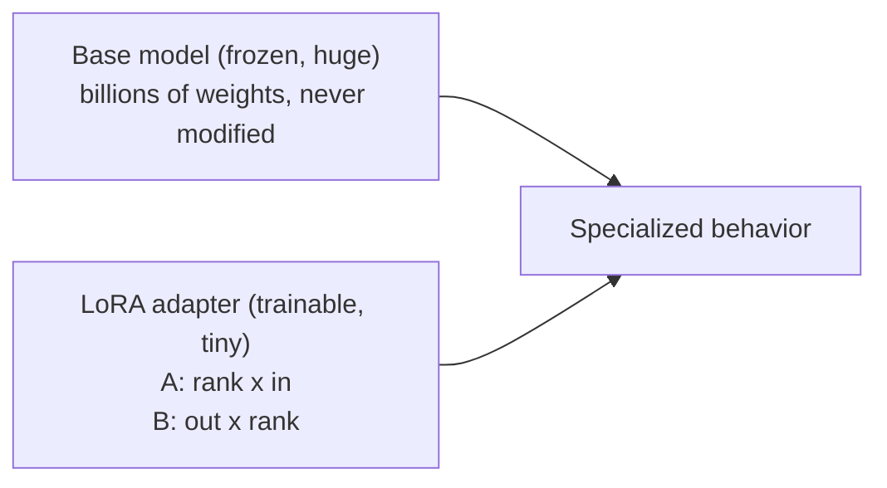

(ch-24)=
# 24. LoRA Explained: Small Adapters That Specialize a Big Model
Fully retraining a multi-billion-parameter model's every weight for a narrow task is enormously wasteful, because most of what the model already knows (grammar, general world knowledge, reasoning patterns) doesn't need to change at all; only a narrow slice of behavior does. **LoRA** (Low-Rank Adaptation), introduced by [Hu et al. (2021)](../references.md#ref-lora), is the technique that exploits this: instead of updating a weight matrix `W` directly, freeze `W` entirely and learn a small *addition* to it, expressed as the product of two much smaller matrices:

```
W_effective = W (frozen, unchanged)  +  scale * (B * A)
                                            ^         ^
                                       small matrix  small matrix
                                    (outDim x rank) (rank x inDim)
```

`rank` is small (typically 4 to 16) versus `W`'s full dimensions, which are often in the thousands. This is the same idea as a git diff versus committing an entirely new file: instead of storing (and training) a new full-size weight matrix, you store a compact "patch" describing only the *delta* from the original, and that patch is dramatically smaller because the useful adaptation, empirically, tends to fit in a low-dimensional subspace of the full weight space.

The size difference is not subtle. For rank-8 LoRA applied to just the query and value attention projections (`wq`, `wv`) across all 22 layers of a 1.1-billion-parameter TinyLlama model:

| | Frozen base weights | LoRA adapter |
|---|---|---|
| Parameters | 1,100,048,000 | 720,896 |
| Memory (F32) | ~4.3 GB | ~2.8 MB |
| Trainable? | No | Yes |

That's roughly a **1,500x** reduction in the number of trainable, storable parameters, which is precisely why LoRA fine-tuning is practical on a single machine, even a laptop, for small models, where full fine-tuning would demand data-center-scale infrastructure.



Two important operational properties fall directly out of this design:

- **The base model is never touched.** LoRA training only ever updates `A` and `B`. This means one base GGUF file can serve many different specializations, each stored as a tiny `.lora` checkpoint file, without ever duplicating the multi-gigabyte base weights, a pattern much like sharing one base Docker image across many lightweight overlay layers.
- **Adapters are swappable at inference time, read-only.** A well-built inference engine can apply a `.lora` file on top of the frozen base purely for that request's forward pass, with no risk of accidentally mutating shared model state: Juno's `--lora-play PATH` flag, for example, loads adapters strictly read-only during inference (`LoraTrainableHandler` wraps the base handler without ever writing back to the GGUF), and defaults to deterministic greedy decoding (temperature 0) specifically so that a trained fact is recalled *reliably* rather than being subject to the sampling randomness discussed in [Chapter 14](#ch-14), because a nearby base-model continuation could otherwise get sampled instead of the memorized answer.

A practical, hands-on training loop, using Juno's REPL as a concrete illustration of the pattern (any LoRA-capable trainer follows the same shape):

```bash
./juno lora --model-path models/tinyllama.gguf
you > /train-qa What is my name? A: Dima
you > /save
```

Behind that one command: gradients are computed only against `A` and `B` (the frozen base weights participate in the forward pass but never accumulate gradients), an optimizer (commonly AdamW) steps those two small matrices toward reducing the loss on the target completion, and the result is persisted as a checkpoint measured in megabytes, not gigabytes: the adapter, not a new copy of the model.

One nuance worth flagging honestly: LoRA is a strong default for many "specialize the behavior" tasks, but it is not free: it still requires clean training data ([Chapter 23](#ch-23)), it still needs evaluation ([Chapter 21](#ch-21)'s techniques apply directly), and rank selection is a real trade-off (rank 4 for quick experiments, rank 8 as a solid general default, rank 16+ for more complex style or domain adaptation) rather than a "bigger is always better" dial.

**Further reading:** Hu, E. J. et al. (2021). [LoRA: Low-Rank Adaptation of Large Language Models](https://arxiv.org/abs/2106.09685). arXiv:2106.09685.

---

[← Chapter 23: Preparing a Fine-Tuning Dataset: From Logs and Tickets to Training Pairs](#ch-23) &nbsp;|&nbsp; [Table of Contents](../index.md) &nbsp;|&nbsp; [Chapter 25: Merge Adapters into GGUF: Shipping One Artifact, No Sidecar Weights →](#ch-25)