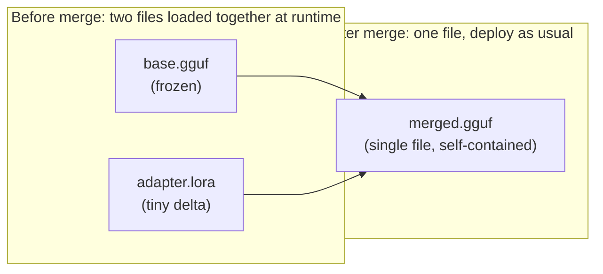

(ch-25)=
# 25. Merge Adapters into GGUF: Shipping One Artifact, No Sidecar Weights
A trained `.lora` adapter is small and cheap, but it comes with an operational cost: every inference server needs both the base GGUF *and* the adapter file, loaded together, and needs to correctly apply the adapter's math (`W + scale * B*A`) on every forward pass: one more moving part, one more thing that can be misconfigured or accidentally omitted in a deployment.

**Merging** collapses the adapter into the base model permanently, producing a single new GGUF file that behaves like the fine-tuned model natively: no sidecar file, no runtime overlay logic, nothing for a deployment script to forget to include:



The engineering wrinkle that makes this non-trivial, and worth understanding rather than treating as a black box, connects directly back to [Chapter 16](#ch-16)'s quantization noise: the base model's weights are typically stored quantized (e.g. `Q4_K`), and quantization introduces rounding error on the order of ~3×10⁻³ per weight element. A trained LoRA delta, by contrast, is *tiny*: typically around 6x10^-4 per element, roughly five times smaller than the quantization noise floor. If you naively added the LoRA delta to the quantized weights and then re-quantized the result back down to `Q4_K`, the re-quantization step would round away the entire delta, so your carefully trained adaptation would simply vanish into rounding error, and the "merged" model would behave identically to the untrained base.

The fix a correct merge implementation uses: store only the *patched* tensors (the handful the LoRA adapter actually touched, commonly the query and value projection matrices per layer) at full F32 precision, and copy every other, untouched tensor across verbatim in its original quantized encoding. For rank-8 LoRA on `wq`/`wv` across 22 layers, that's 44 tensors stored at higher precision; everything else stays exactly as quantized as it was in the base file.

```bash
# 1. Train (Chapter 24)
./juno lora --model-path /models/tinyllama.gguf
you > /train-qa What is your name? A: Juno
you > /save

# 2. Merge -- writes tinyllama-merged.gguf, patched tensors stored as F32
./juno merge --model-path /models/tinyllama.gguf

# 3. Deploy the merged file like any other model -- no .lora sidecar needed
./juno local --model-path /models/tinyllama-merged.gguf
you > what is your name?
bot > Juno
```

Expect a modest file size increase from this trade-off: a TinyLlama Q4_K_M base around 667 MB produces a merged file around 1 GB, because 44 tensors moved from ~4.5 bits/weight to 32 bits/weight while everything else stayed the same size.

**When to merge versus keep the adapter separate:** merge when you're shipping a single, stable, production model artifact and want zero runtime overlay complexity: one file, one deployment, one thing to version. Keep the adapter separate (via a read-only inference overlay, [Chapter 24](#ch-24)) when you have many specializations of the same base model and want to swap between them without duplicating the multi-gigabyte base weights for each one: the classic space/simplicity trade-off, decided per deployment, not universally.

One more thing worth carrying forward from [Chapter 3](#ch-03)'s data-quality discipline and [Chapter 20](#ch-20)'s safety discipline: **merging and redistributing a fine-tuned model can carry licensing obligations from the base model**, because a merged GGUF is generally considered more clearly a "derivative work" of the base model than the tiny adapter file alone was. [Chapter 34](#ch-34) covers this in the depth it deserves; the short version here is: before you redistribute a merged model outside your own infrastructure, check the base model's license, not just your own training data's provenance.

---

[← Chapter 24: LoRA Explained: Small Adapters That Specialize a Big Model](#ch-24) &nbsp;|&nbsp; [Table of Contents](../index.md) &nbsp;|&nbsp; [Chapter 26: CPU vs GPU Inference: When CUDA/ROCm Matter and When Quantized CPU Wins →](#ch-26)
