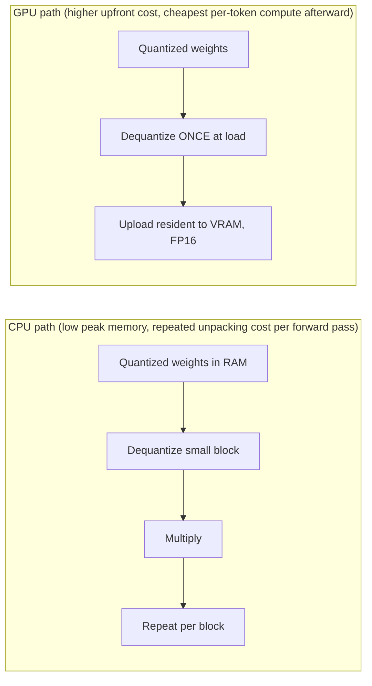

(ch-26)=
# 26. CPU vs GPU Inference: When CUDA/ROCm Matter and When Quantized CPU Wins
The forward pass ([Chapter 5](#ch-05)) is, at its core, a long sequence of matrix-vector multiplications. GPUs are purpose-built for exactly this kind of massively parallel, regular numerical workload: thousands of simple cores doing the same arithmetic operation on different data simultaneously, which is precisely what multiplying a weight matrix by an activation vector looks like at the hardware level. CPUs, by contrast, have far fewer, more general-purpose cores optimized for branching, varied instruction streams, and low-latency single-threaded work.

This isn't an abstract distinction: it shows up directly in inference server design. Two GPU vendor paths dominate today, both reachable from pure Java without JNI wrapper libraries via `java.lang.foreign` (Panama FFI), the same low-overhead native-call mechanism used to talk to CUDA and ROCm directly:

| Vendor | Library | Java binding approach |
|---|---|---|
| NVIDIA | CUDA 12.x + cuBLAS | `java.lang.foreign.Linker` resolves `libcudart.so`/`libcublas.so` directly: no JNI wrapper |
| AMD | ROCm 6+/7+ + rocBLAS | Same Panama FFI approach, resolving `libamdhip64.so`/`librocblas.so` |

A well-designed inference engine auto-selects the best available backend at startup (CUDA first, then ROCm, then CPU quantized fallback) and falls back gracefully if GPU memory allocation fails partway through loading a model, rather than crashing outright. This is a resilience pattern worth internalizing regardless of the specific stack: **treat GPU acceleration as an optimization with a correctness-preserving fallback, not a hard dependency the system can't function without.**

**When GPU wins decisively:** large models, high-throughput serving with many concurrent requests, and any workload where raw tokens-per-second matters more than infrastructure simplicity. The parallelism advantage compounds with model size, because bigger matrices mean more work to parallelize.

**When quantized CPU inference is the right call, not just a fallback:**

- **Small-to-medium models** (roughly up to a few billion parameters) at aggressive quantization (`Q4_K` and similar, [Chapter 16](#ch-16)) run at genuinely usable speeds on ordinary CPU hardware: this is precisely why quantized GGUF became the standard local-inference format.
- **Low concurrency, cost-sensitive deployments.** A `2 vCPU / 8 GB RAM` cloud instance with no GPU is dramatically cheaper than any GPU instance, and for single-user or low-traffic scenarios, CPU throughput is entirely adequate.
- **Simplicity and portability.** No GPU driver installation, no CUDA/ROCm version matching headaches, no VRAM budgeting: a real operational win, especially for on-prem deployments where you don't control the hardware fleet.
- **Development and testing.** Nobody should need a GPU to run integration tests against a stub or small model locally.

A useful mental model for the actual matmul hot path on CPU: **lazy, block-wise dequantization.** Rather than dequantizing an entire weight matrix to full precision up front (which would briefly spike memory usage back to something like the original FP32 footprint, defeating much of quantization's purpose), a well-tuned CPU path dequantizes one small block (say, 256 elements) at a time, right inside the multiplication loop, keeping peak live memory for that operation down around a kilobyte instead of tens of megabytes, at the cost of doing that unpacking work repeatedly on every forward pass rather than once at load time. GPU paths typically make the opposite trade: dequantize once, upload the result resident in device memory (often as FP16) at load time, and pay that cost once instead of on every token.

The practical sizing exercise, regardless of vendor stack: match model size and quantization level to your concurrency and latency requirements *before* reaching for GPU hardware by default. A surprising number of production LLM features never need a GPU at all.

---

[← Chapter 25: Merge Adapters into GGUF: Shipping One Artifact, No Sidecar Weights](#ch-25) &nbsp;|&nbsp; [Table of Contents](../index.md) &nbsp;|&nbsp; [Chapter 27: Profiling LLM Workloads with JFR: Matmul, Forward Pass, and Tokens/sec →](#ch-27)
