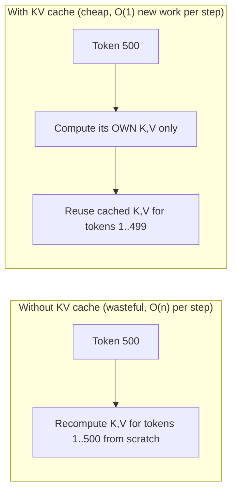
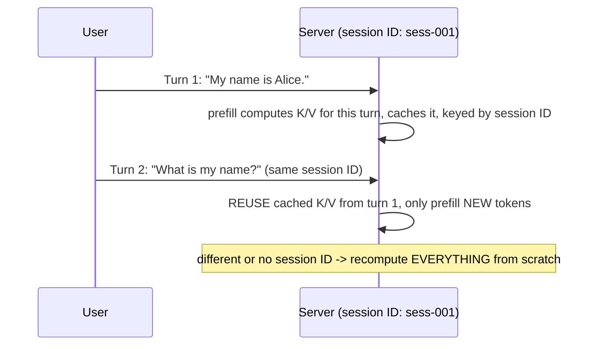

(ch-28)=
# 28. Memory, KV Cache, and Session Affinity: Why Chat Feels Faster the Second Time
Here's a puzzle worth sitting with: generating token 500 of a long response requires the model to attend to (mathematically incorporate) all 499 tokens that came before it, at every layer. Naively, that means recomputing attention over the *entire* growing history at every single decode step: an O(n^2) cost as the conversation grows, and enormously wasteful, since tokens 1 through 499 didn't change between step 499 and step 500.

The **KV cache** (key/value cache) is the optimization that eliminates this waste, and it's exactly the same idea as memoization applied to a specific, very regular computation: the "key" and "value" vectors the attention mechanism computes for each token, at each layer, don't change once computed: they only ever get *referenced* by later tokens, never recomputed. So compute them once, per token, per layer, and cache them.



This cache is exactly why the *first* token of a response typically takes noticeably longer to appear than each subsequent token: that initial delay is the **prefill** phase, computing K/V for the entire input prompt in one batched pass before generation can begin; every token after that is comparatively cheap **decode**, reusing everything already cached.

This directly explains a UX phenomenon most people notice without knowing why: **a multi-turn conversation can feel faster on later turns than the raw amount of text would suggest**, *if* the serving infrastructure is reusing the KV cache across turns instead of recomputing it from scratch for the entire conversation history on every single message. That reuse requires the server to recognize "this new request is a continuation of that earlier session," not a fresh, unrelated prompt, which is precisely what **session affinity** provides.



In an OpenAI-compatible API surface, this is typically exposed as an optional extension field, since the base OpenAI contract has no native concept of it: Juno's `x_juno_session_id`, for example, is a namespaced extension precisely for this purpose:

```python
def chat(messages):
    return client.chat.completions.create(
        model="tinyllama...",
        messages=messages,
        extra_body={"x_juno_session_id": "sess-my-conversation-001"},
    )
```

Well-designed KV cache management is tiered, the same way a well-designed application cache is tiered (in-process, then Redis, then database): a fast GPU-resident tier for active sessions bounded by a byte budget with LRU-style eviction, backed by a larger, slower CPU tier (commonly using an adaptive eviction policy like W-TinyLFU) for sessions that have gone briefly idle but might resume, restoring transparently on the next request rather than forcing a full recompute the moment a session goes quiet. At larger scale, production serving engines go further and manage the GPU-resident tier itself as fixed-size, non-contiguous pages, an approach called PagedAttention, borrowed directly from operating-system virtual memory paging by [Kwon et al. (2023)](../references.md#ref-pagedattention) to eliminate the memory fragmentation that naive contiguous KV-cache allocation causes.

The operational trade-off to internalize: KV cache costs *memory* (GPU VRAM or system RAM, scaling with context length and number of concurrent sessions) in exchange for *not recomputing* work you've already done: precisely the classic space/time trade-off, just applied to a domain where the "recomputation" avoided happens to be a transformer forward pass rather than a database query.

**Further reading:** Kwon, W. et al. (2023). [Efficient Memory Management for Large Language Model Serving with PagedAttention](https://arxiv.org/abs/2309.06180). *SOSP 2023*.

---

[← Chapter 27: Profiling LLM Workloads with JFR: Matmul, Forward Pass, and Tokens/sec](#ch-27) &nbsp;|&nbsp; [Table of Contents](../index.md) &nbsp;|&nbsp; [Chapter 29: Continuous Batching: Serving Many Users Without Serving Them One at a Time →](#ch-29)