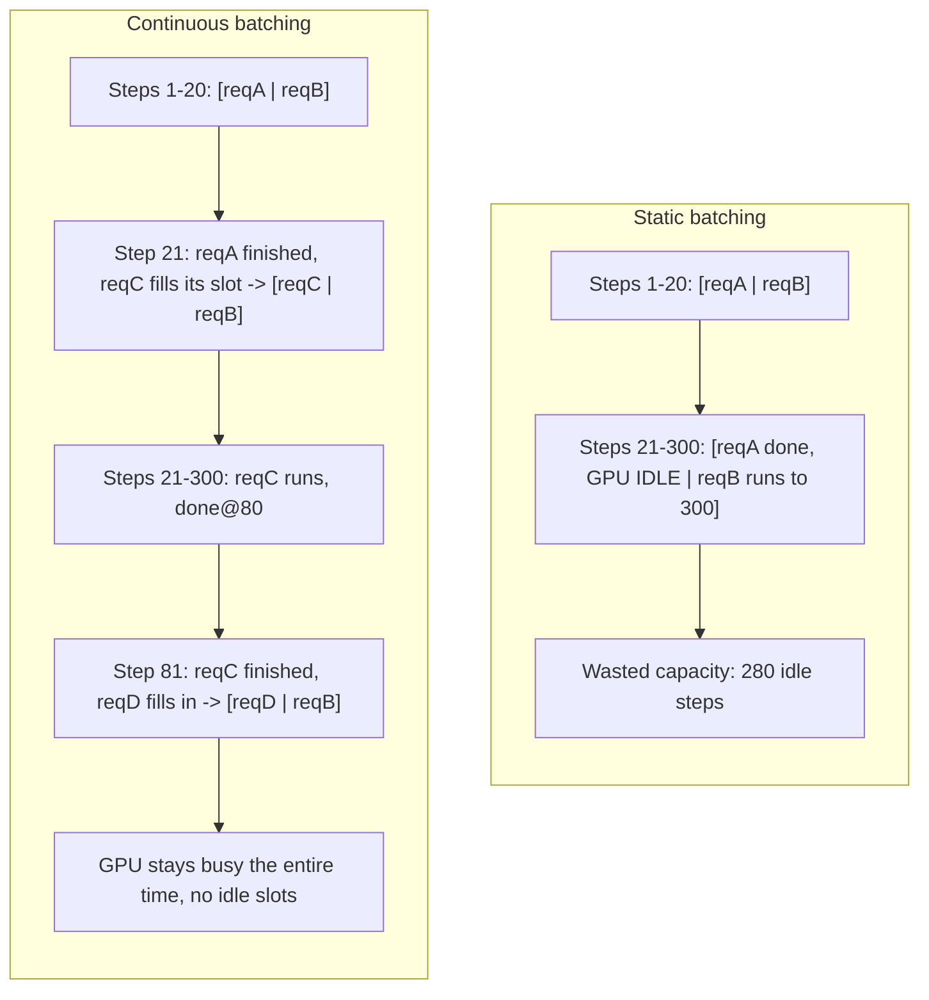

(ch-29)=
# 29. Continuous Batching: Serving Many Users Without Serving Them One at a Time
Here's the naive approach to handling multiple concurrent chat requests, and why it fails badly at scale: process request A completely (all its tokens, start to finish), *then* start on request B. This is exactly a single-threaded request queue with no concurrency: every user waits behind everyone ahead of them in line, and total latency scales linearly with the number of concurrent users, which is unacceptable for anything beyond a single-user demo.

The next-obvious fix, batching requests together and processing several at once for better hardware utilization, runs into a real complication that's easy to miss: **different requests finish at different times.** Request A might need 20 tokens to complete; request B, started at the same moment, might need 300. **Static batching** (wait for a fixed-size batch, process it all the way to completion together, only then start the next batch) wastes enormous throughput, because the whole batch is held hostage by its slowest member: the moment request A finishes at token 20, its GPU slot sits idle for the remaining 280 steps needed to finish request B, when it could have picked up an entirely new request instead.

**Continuous batching** (also called dynamic or in-flight batching, and introduced under the name "iteration-level scheduling" by [Yu et al., 2022](../references.md#ref-orca) in the Orca serving system) solves this by decoupling the batch's *membership* from any individual request's *lifetime*: as soon as any request in the currently-running batch finishes (hits its stop condition or max tokens), a new waiting request is immediately slotted into that now-vacant position: the batch composition changes continuously, token-step by token-step, rather than being fixed for the whole batch's duration.

This is conceptually very close to a well-tuned thread pool executor versus a naive sequential task runner: you want the underlying compute resource (GPU, or a pool of worker threads) kept continuously saturated with useful work, rather than blocked idle waiting for the slowest member of an artificially fixed cohort to finish. A `RequestScheduler` implementing this pattern typically leans on virtual threads or an equivalent lightweight concurrency primitive precisely because the number of in-flight, mostly-waiting sessions can be large, and OS-thread-per-session would exhaust the thread pool long before it exhausted GPU capacity, because this is exactly the kind of I/O-and-wait-heavy workload virtual threads were designed for.

The metric this optimizes directly is the `s9`-style aggregate throughput measurement referenced in performance benchmarking ([Chapter 27](#ch-27)'s TPS metric, measured under concurrent load rather than a single session): aggregate tokens-per-second across N simultaneous sessions, which continuous batching keeps close to N times single-session throughput, rather than degrading sharply as static batching would once session lengths start to vary, which, in any real production chat workload, they always do.

A practical way to reason about whether your serving layer needs this at all: if you genuinely only ever serve one request at a time (a personal local assistant, a single-user CLI tool), continuous batching buys you nothing, because it's a concurrency optimization, and its value is exactly proportional to how many simultaneous users your system needs to keep happy at once. The moment you're serving more than a handful of concurrent sessions with meaningfully different response lengths, it stops being an optimization and starts being close to a requirement.

**Further reading:** Yu, G.-I., Jeong, J. S., Kim, G.-W., Kim, S., & Chun, B.-G. (2022). [Orca: A Distributed Serving System for Transformer-Based Generative Models](https://www.usenix.org/conference/osdi22/presentation/yu). *OSDI 2022*.

---

[← Chapter 28: Memory, KV Cache, and Session Affinity: Why Chat Feels Faster the Second Time](#ch-28) &nbsp;|&nbsp; [Table of Contents](../index.md) &nbsp;|&nbsp; [Chapter 30: Pipeline vs Tensor Parallelism: Splitting Transformers Across Machines →](#ch-30)