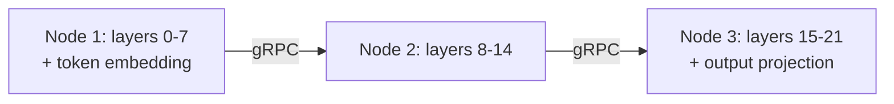
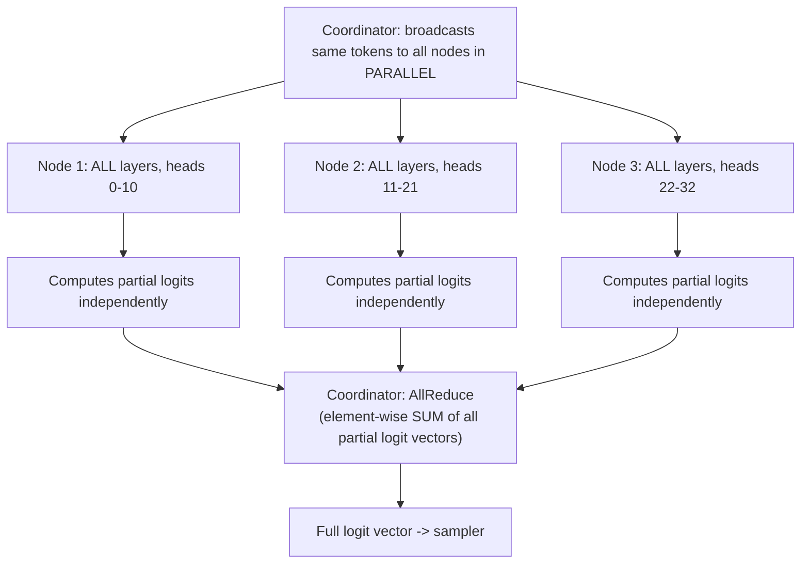

(ch-30)=
# 30. Pipeline vs Tensor Parallelism: Splitting Transformers Across Machines
Once a model is too large for a single machine's memory (GPU VRAM or system RAM, whichever is the binding constraint), you need to split it across multiple machines. Two fundamentally different strategies exist, and they trade off differently, in a way that will feel familiar if you've ever chosen between sharding a database by table versus sharding it by row range.

**Pipeline parallelism** splits the model *by depth*: contiguous blocks of transformer layers are assigned to different nodes, and activations flow serially through them, node to node, like stations on an assembly line.

Adding a node under pipeline parallelism increases total available memory (each node only needs to hold its own slice of the weights), which is exactly what lets you fit a model too big for any single machine. The cost is latency: each decode step pays for N-1 sequential network hops, one per node boundary, because node 2 cannot begin its work until node 1's activations for that step have arrived.

**Tensor parallelism** splits the model *by width* instead: every node holds the *full depth* of all transformer layers, but only a horizontal slice of each layer's weight matrices: a subset of attention heads and a proportional slice of the feed-forward width. This intra-layer splitting approach, and the AllReduce-based communication pattern below, was popularized at scale by [Shoeybi et al. (2019)](../references.md#ref-megatron) in the Megatron-LM paper, which trained an 8.3-billion-parameter transformer across 512 GPUs using exactly this technique.

Here the coordinator broadcasts the same input to every node *simultaneously* (not serially), each node computes its partial contribution to the output independently and in parallel, and the coordinator combines the partial results with an **AllReduce** (element-wise sum) to reconstruct the full result. Adding nodes under tensor parallelism increases *throughput* and *reduces per-node memory pressure*, at the cost of requiring one broadcast plus N parallel round-trips per decode step, and a hard structural constraint: the number of attention heads must divide evenly by the node count, since you can't split a single attention head across two machines.

| | Pipeline parallel | Tensor parallel |
|---|---|---|
| Splits the model by | Depth (layer ranges) | Width (head/FFN slices) |
| Communication pattern | Serial, node-to-node | Parallel broadcast + AllReduce |
| Per-step network cost | N-1 sequential hops | 1 broadcast + N parallel calls |
| Adding nodes helps... | Fit a bigger model | Increase throughput |
| Constraint | None structural | `numHeads % nodeCount == 0` |
| Needs special interconnect (e.g. InfiniBand)? | Not required | Not required for star AllReduce specifically |

The database sharding analogy holds up well: pipeline parallelism is like splitting a large table across shards *by column range* (each shard holds all rows but only some columns, and a full row-read has to visit shards in sequence). More precisely, pipeline parallelism is like a multi-stage ETL pipeline where each stage lives on a different machine and data flows through in order; tensor parallelism is closer to sharding rows across replicas that each hold the full schema but a fraction of the rows, computing partial aggregates independently and combining them at the end, which is exactly what a scatter-gather query pattern does.

Neither is universally better; the choice depends on what you're optimizing for. If the model simply doesn't fit anywhere, pipeline parallelism is the only option that solves *that* problem. If the model fits but you need more throughput to serve more concurrent users, tensor parallelism scales that dimension more directly. Production systems select the strategy as a startup-time configuration choice (commonly a `--pType pipeline|tensor` style flag) precisely because it's a deployment-topology decision, not something that needs to vary per request.

**Further reading:** Shoeybi, M. et al. (2019). [Megatron-LM: Training Multi-Billion Parameter Language Models Using Model Parallelism](https://arxiv.org/abs/1909.08053). arXiv:1909.08053.

---

[← Chapter 29: Continuous Batching: Serving Many Users Without Serving Them One at a Time](#ch-29) &nbsp;|&nbsp; [Table of Contents](../index.md) &nbsp;|&nbsp; [Chapter 31: Production Serving Patterns: Health Dashboards, Priorities, and Multi-Tenant Chat APIs →](#ch-31)