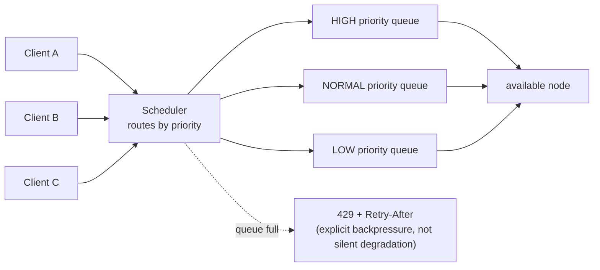

(ch-31)=
# 31. Production Serving Patterns: Health Dashboards, Priorities, and Multi-Tenant Chat APIs
Running one model on one machine for a demo is a different engineering problem than running a fleet of model-serving nodes for production traffic. This chapter is about the operational layer that sits *around* inference: the part that has nothing to do with transformer math and everything to do with running any distributed service reliably, applied to this specific domain.

**Health monitoring.** A distributed inference cluster needs the same category of observability any distributed system needs: per-node liveness, load, and latency, rolled up into a cluster-wide view. A dedicated health dashboard endpoint (commonly a simple embedded web console alongside the API) surfacing per-node CPU load, coordinator P99 latency, and per-node throughput gives operators the same "is the fleet healthy" glance they'd expect from any service mesh dashboard, and, just as importantly, a `/health` style endpoint that load balancers and orchestrators (Kubernetes readiness probes, for instance) can poll to make automated routing and restart decisions without a human watching a graph.

```
GET /health-ui  -->  per-node CPU load, coordinator P99, node throughput, at a glance
GET /cluster/health --> machine-readable rollup for automated tooling / alerting
```

**Request prioritization.** Not all requests are equal, and a production chat API almost always needs a way to express that: an internal batch-summarization job shouldn't compete for the same GPU slot as a real-time user-facing chat request. A priority-aware scheduler (`HIGH` / `NORMAL` / `LOW`, commonly, exposed as a request-level field like `x_juno_priority` in an OpenAI-compatible extension) lets the request queue reorder work by business importance rather than strict arrival order, precisely the same concept as priority queues in any job-scheduling system, applied to inference requests instead of background jobs.

**Multi-tenant chat APIs.** Serving multiple distinct clients or customers from shared infrastructure raises the same concerns multi-tenancy always raises, just with model-serving-specific instantiations:

- **Session isolation.** Each client's conversation history (and its KV cache, [Chapter 28](#ch-28)) must never leak into another client's context: a session ID needs to function as a genuine isolation boundary, not just a convenience key.
- **Resource fairness.** One tenant sending a burst of long-running requests shouldn't starve every other tenant's requests: this is where priority scheduling and, commonly, per-tenant rate limiting or queue depth limits come in.
- **Backpressure signaling.** When the scheduler's queue is genuinely full, the correct response is an explicit, honest error: an HTTP `429 Too Many Requests` with a `Retry-After` header, following the same convention any rate-limited REST API would use, rather than accepting the request and letting it silently degrade the entire cluster's latency for everyone.



The throughline across all of this: **serving LLMs in production is a distributed-systems engineering problem first, and a machine-learning problem a distant second.** Everything you already know about health checks, priority scheduling, backpressure, and tenant isolation from building any other production distributed service transfers directly, because the transformer forward pass is just the specific unit of work being scheduled and load-balanced.

---

[← Chapter 30: Pipeline vs Tensor Parallelism: Splitting Transformers Across Machines](#ch-30) &nbsp;|&nbsp; [Table of Contents](../index.md) &nbsp;|&nbsp; [Chapter 32: Observability for LLM Apps: Tracing Tokens, Costs, and Latency Like Any Other Distributed Call →](#ch-32)
