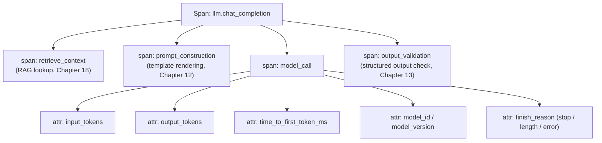

(ch-32)=
# 32. Observability for LLM Apps: Tracing Tokens, Costs, and Latency Like Any Other Distributed Call
An LLM call from your application's point of view should be treated as exactly what it is: **a distributed, potentially expensive, potentially slow, potentially flaky remote call**, and instrumented with the same discipline you'd apply to any external service dependency, not treated as a mysterious black box because "AI" is in its description.

Three categories of signal matter specifically for LLM calls, on top of everything you'd already track for any RPC (latency, error rate, retries):

**Token accounting.** Because most providers bill per token ([Chapter 7](#ch-07)) and context windows are a hard capacity limit, tracking input tokens, output tokens, and total tokens *per request*, not just per aggregate billing period, is both a cost-observability concern and a debugging concern: a sudden spike in average input tokens per request is often the first visible symptom of a RAG pipeline ([Chapter 18](#ch-18)) retrieving too many or too-large chunks, well before anyone notices the resulting latency or cost increase through any other signal.

**Latency, broken into phases, not one number.** [Chapter 28](#ch-28) introduced the prefill/decode split; that split should show up directly in your traces, because "the response was slow" is a much less actionable signal than "prefill took 400ms because the prompt was unusually long" versus "decode was slow because the cluster was saturated." Time-to-first-token (TTFT, dominated by prefill) and inter-token latency (dominated by decode) are genuinely different metrics with different root causes, and conflating them into a single "total request time" number throws away the information you need to actually diagnose a regression.

**Cost attribution.** Because token cost varies by model, and a given feature might route to different models depending on request complexity or user tier, cost needs to be tracked as a first-class metric per request, attributed back to the feature, endpoint, or tenant that triggered it, the same way you'd track cloud infrastructure cost per service, not lumped into one opaque monthly total that makes it impossible to answer "which feature is expensive and why."

Wiring this into standard distributed tracing infrastructure ([OpenTelemetry](../references.md#ref-otel) spans, structured logs feeding your existing log aggregation, whatever your organization already uses for every other service) is almost always the right move over inventing a bespoke LLM-specific observability stack: an LLM call is a span like any other span, with a few domain-specific attributes attached (token counts, model ID, finish reason) rather than a fundamentally different kind of telemetry requiring its own tooling.

The finish reason attribute deserves particular attention because it's cheap to capture and disproportionately useful: distinguishing `stop` (the model naturally finished), `length` (it was cut off by `max_tokens`, often a silent correctness bug, since a truncated JSON response or truncated summary looks superficially fine until something downstream tries to parse or act on it), and `error` lets you build alerting on the *shape* of failures, not just their raw frequency: a sudden rise in `length` finish reasons, for instance, is a very specific, very actionable signal (either prompts got longer, or a `max_tokens` value was set too conservatively) that a flat "error rate" metric would completely miss.

**Further reading:** OpenTelemetry Authors. [OpenTelemetry documentation](https://opentelemetry.io/docs/).

---

[← Chapter 31: Production Serving Patterns: Health Dashboards, Priorities, and Multi-Tenant Chat APIs](#ch-31) &nbsp;|&nbsp; [Table of Contents](../index.md) &nbsp;|&nbsp; [Chapter 33: Model and Prompt Versioning: Rollout, Rollback, and A/B Testing for Non-Deterministic Systems →](#ch-33)