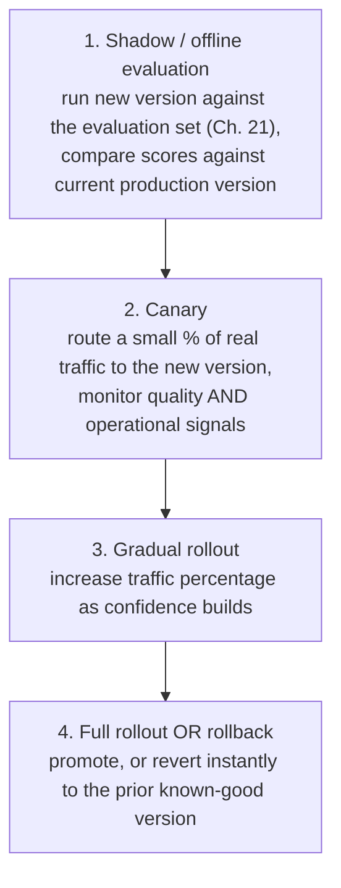

(ch-33)=
# 33. Model and Prompt Versioning: Rollout, Rollback, and A/B Testing for Non-Deterministic Systems
You already have strong instincts for versioning, rollout, and rollback of a `.jar` artifact: semantic versioning, canary deployments, feature flags, the ability to revert to a known-good build within minutes of a bad release. Every one of those instincts applies to LLM-backed features, but the artifact being versioned is now a *combination* of several independently-changing pieces, and that combination is what needs a version identity, not any single piece alone.

```
"Version" of an LLM feature =  { model checkpoint/adapter, prompt template, sampling params,
                                  retrieval index version, tool/function definitions }
```

Change any one of those five, and behavior can shift, sometimes subtly, sometimes dramatically. A prompt template edit, a base model upgrade, a newly re-merged LoRA adapter ([Chapter 25](#ch-25)), or even a re-indexed RAG corpus ([Chapter 18](#ch-18)) are all, functionally, **deployments**, and deserve exactly the same rigor a code deployment gets: a version identifier, a changelog entry, and, critically, an evaluation run ([Chapter 21](#ch-21)'s evaluation sets) *before* it reaches production traffic, not after.

**Rollout strategy** needs to account for the fact that "did this change work" is a statistical question here, not a binary pass/fail one: you're not asking "did the build compile," you're asking "did quality, measured across an evaluation set and real traffic, hold steady or improve," which requires comparing distributions, not single outcomes.



**A/B testing** an LLM change follows the same statistical discipline as A/B testing any product change: a control group on the old version, a treatment group on the new one, a predefined success metric decided *before* looking at results (to avoid the classic trap of retroactively picking whichever metric happened to look favorable), with one LLM-specific wrinkle worth calling out explicitly: because outputs are non-deterministic even for the identical version and identical input ([Chapter 14](#ch-14)'s sampling), you need a genuinely larger sample size than you might intuitively expect to distinguish "version B is actually better" from "version B just happened to sample better completions this batch by chance." Treat sampling temperature as an additional source of variance in your statistical power calculation, not something you can ignore because "the code didn't change."

**Rollback** needs to be as fast and as low-risk as reverting a bad code deploy, which means every piece of the "version" bundle above needs to be independently reproducible and pinnable, not just "whatever model file happens to currently be in the models directory." Pin exact model checkpoint hashes (not just a human-readable name: "the merged model" is not a version identifier; a specific content hash is), pin exact prompt template versions (checked into version control, per [Chapter 12](#ch-12)'s recommendation), and pin the exact retrieval index snapshot if your RAG corpus changes over time. The goal is that "roll back to yesterday's version" is a deterministic, single, well-defined operation, not an archaeological investigation into which of five loosely-coupled pieces changed and needs to be manually reverted.

A concrete habit that pays for itself repeatedly: **tag every production response, in your logs, with the full version bundle that produced it**: model checkpoint hash, prompt template version, sampling parameters, retrieval index version. When a quality regression is reported days after a change, this is the difference between "we can immediately correlate the complaint with the deploy that caused it" and "we have no idea which of several recent changes might be responsible," precisely the same value a build/commit ID stamped into every log line provides for ordinary application debugging, just covering a wider surface of what "the version" actually means for this kind of system.

---

[← Chapter 32: Observability for LLM Apps: Tracing Tokens, Costs, and Latency Like Any Other Distributed Call](#ch-32) &nbsp;|&nbsp; [Table of Contents](../index.md) &nbsp;|&nbsp; [Chapter 34: Compliance for Generative Apps: Licenses, Merged Weights, and EU AI Act Reality Checks →](#ch-34)
