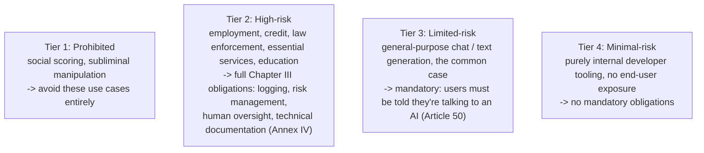

(ch-34)=
# 34. Compliance for Generative Apps: Licenses, Merged Weights, and EU AI Act Reality Checks
Shipping a generative AI feature carries legal and regulatory obligations layered on top of the engineering ones, and unlike a typical open-source dependency-license question, several of these are specific to this domain and easy to overlook if you're applying only your existing "check the `LICENSE` file" instincts.

**Model weight licenses are separate from the engine's license.** An inference engine's own license (commonly permissive, e.g. Apache 2.0) covers only the *code*: it grants you no rights whatsoever to the third-party model weights (GGUF files or otherwise) that the engine happens to load at runtime. Each base model carries its own, independent license, and terms vary meaningfully:

| Model family | License | Commercial use | Notable constraint |
|---|---|---|---|
| LLaMA 3 | Meta Llama 3 Community License | Yes, with conditions | Requires a separate agreement above 700M monthly active users |
| Mistral 7B | Apache 2.0 | Yes | Standard permissive terms |
| Phi-3 / Phi-3.5 | MIT | Yes | Standard permissive terms |
| Gemma 2 | Gemma Terms of Use | Yes, with conditions | A specific prohibited-use policy applies |

The operational takeaway: obtaining a model file and reviewing its license is *your* responsibility as the operator, independent of whatever engine you're using to serve it: an inference engine does not, and cannot, vet the provenance or licensing status of every model it's capable of loading, any more than a JVM vets the licensing status of every jar you happen to run on it.

**Fine-tuned and merged models raise their own, distinct question ([Chapter 25](#ch-25) revisited from a legal rather than technical angle).** A `.lora` adapter's legal status as a "derivative work" is genuinely unsettled and jurisdiction-dependent, so the conservative, safe default is to treat it as a derivative of the base model and apply the base model's license terms to it. A **merged** GGUF ([Chapter 25](#ch-25)) is more clearly a derivative work than the small adapter alone was, because it physically contains the base model's weights combined with your trained delta in one artifact. Before redistributing a merged model outside your own infrastructure: confirm the base model's license actually permits redistribution of derivative works at all, confirm your own training data doesn't introduce a *separate* copyright question, and include any required attribution.

**The EU AI Act, and why "the engine is compliant" is close to a category error.** The Act — formally [Regulation (EU) 2024/1689](../references.md#ref-euaiact) — regulates **AI systems**: the deployed combination of engine, model, and specific use case, not inference infrastructure in the abstract. An inference engine is, in the Act's own vocabulary, closer to "third-party infrastructure" than to an "AI system provider" itself; the entity that deploys the engine plus a model and makes the resulting system available to end users is the one carrying most of the regulatory obligations.

*(tiers are mapped to a deployed system's USE CASE, not to the engine you chose)*

The most commonly-missed obligation, precisely because it sounds almost too simple to be a real compliance requirement, is **Article 50 transparency**: for essentially any public-facing chat or content-generation feature, users must be informed they're interacting with an AI system, unless that's already obvious from context. It's a low-effort fix: a disclosure field in the response, a UI banner, a note in the system prompt-adjacent product surface, and it applies at the *limited-risk* tier, meaning it's very likely relevant to whatever general-purpose chat feature you're shipping, not just to exotic high-risk use cases.

If your deployment lands in the high-risk tier (employment screening, credit decisions, healthcare triage, and similar Annex III domains), the obligation set is substantially heavier, and largely orthogonal to anything the inference engine itself provides: audit logging beyond ordinary performance metrics (capturing who made a request, what was returned, and which model version produced it, connecting directly back to [Chapter 33](#ch-33)'s versioning discipline, which becomes a compliance requirement rather than merely an operational nicety at this tier), a documented risk management process, human oversight mechanisms for reviewing or overriding outputs before they take effect, and Annex IV-style technical documentation covering accuracy and known limitations.

None of this is a reason to avoid building generative AI features: it's a reason to treat compliance the way you'd treat any other cross-cutting production requirement, like security or accessibility: identify which tier your specific use case falls into *early*, in the design phase, rather than as an afterthought bolted on right before a launch date that's already been announced.

---

*This is not legal advice; consult qualified counsel for decisions specific to your deployment, jurisdiction, and use case. It is, however, a starting checklist that will save you from the most common and most avoidable mistakes.*

**Further reading:** European Parliament and Council of the European Union. (2024). [Regulation (EU) 2024/1689 laying down harmonised rules on artificial intelligence](https://eur-lex.europa.eu/eli/reg/2024/1689/oj) (Artificial Intelligence Act). *Official Journal of the European Union*.

---

[← Chapter 33: Model and Prompt Versioning: Rollout, Rollback, and A/B Testing for Non-Deterministic Systems](#ch-33) &nbsp;|&nbsp; [Table of Contents](../index.md) &nbsp;|&nbsp; [Chapter 35: Classical ML: Regression, Trees, and Ensembles →](../part5/35-classical-ml-regression-trees-ensembles.md)
