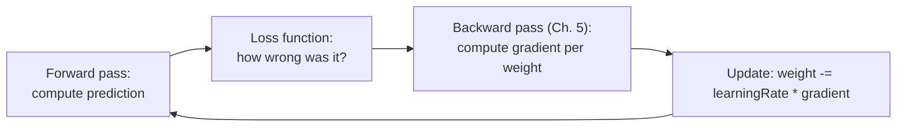

(ch-36)=
# 36. Loss Functions, Gradient Descent, and the Bias-Variance Trade-off
[Chapter 5](#ch-05) mentioned that backpropagation drives learning by measuring "how wrong was this prediction," and [Chapter 23](#ch-23) mentioned loss again in passing when discussing fine-tuning. This chapter finally opens that box: what a loss function actually is, how a model uses it to improve, and why a model that improves too well on its training data is a warning sign, not a success.

A **loss function** is a single number quantifying how wrong a prediction was, the same conceptual role a unit test's assertion failure message plays: it doesn't just say pass/fail, it says *how far off*. Two loss functions cover the overwhelming majority of practical cases:

- **Mean Squared Error (MSE)**: `average((prediction - actual)^2)`, used for regression (predicting a number). Squaring penalizes large errors disproportionately, the same way a p99 latency SLO cares more about your worst outliers than your median.
- **Cross-entropy loss**: measures the gap between a predicted probability distribution and the actual correct answer, used for classification (predicting a category) and for language modeling itself, since "predict the next token" ([Chapter 7](#ch-07)) is really just classification over the entire vocabulary at each step.

**Gradient descent** is the algorithm that uses the loss to actually improve the model: compute how the loss would change if each weight nudged slightly up or down (the gradient), then nudge every weight a small step in the direction that reduces loss, and repeat.

This is exactly a hill-climbing search, except walking *downhill* toward lower loss, and the **learning rate** is the step size: too large and you overshoot the minimum and bounce around unstably (imagine a retry-with-backoff loop that backs off too aggressively and never converges); too small and training crawls, technically correct but practically unusable. In practice almost nobody uses plain gradient descent: **Adam** ([Kingma & Ba, 2015](../references.md#ref-adam)), which adapts the step size per-parameter based on the recent history of gradients, is the default optimizer behind the vast majority of modern training runs, including the LoRA training loop in [Chapter 24](#ch-24).

The harder, more counterintuitive lesson is the **bias-variance trade-off**, and it's the reason "just keep training until the loss hits zero" is bad advice:

| | Underfitting (high bias) | Overfitting (high variance) |
|---|---|---|
| Symptom | Poor accuracy on *both* training and validation data | Excellent accuracy on training data, poor on validation data |
| Cause | Model too simple, or stopped training too early, to capture the real pattern | Model memorized training-set noise instead of learning the general pattern |
| Java analogy | A regex so generic it matches almost anything | A regex so specific it only matches the exact test strings you wrote it against |
| Fix | Bigger model, more features, train longer | More training data, regularization, or a validation-based early stop |

A model that scores 99.9% accuracy on its training set and 60% on held-out validation data hasn't learned the pattern, it's memorized the answer key, exactly the failure mode [Chapter 3](#ch-03)'s train/validation/test split exists to catch. **Regularization** techniques counter this directly: L2 regularization penalizes large weights in the loss function itself (discouraging the model from relying too heavily on any single feature), and **dropout** ([Srivastava et al., 2014](../references.md#ref-dropout)) randomly disables a fraction of neurons on each training step, forcing the network to not depend on any one path through it, the same resilience principle behind not routing 100% of traffic through a single instance with no failover.

**Further reading:** Kingma, D. P., & Ba, J. (2015). [Adam: A Method for Stochastic Optimization](https://arxiv.org/abs/1412.6980). *ICLR 2015* · Srivastava, N., Hinton, G., Krizhevsky, A., Sutskever, I., & Salakhutdinov, R. (2014). [Dropout: A Simple Way to Prevent Neural Networks from Overfitting](https://jmlr.org/papers/v15/srivastava14a.html). *JMLR*, 15(1), 1929–1958.

---

[← Chapter 35: Classical ML: Regression, Trees, and Ensembles](#ch-35) &nbsp;|&nbsp; [Table of Contents](../index.md) &nbsp;|&nbsp; [Chapter 37: Evaluating Classical Models: Precision, Recall, ROC-AUC, and Confusion Matrices →](#ch-37)
