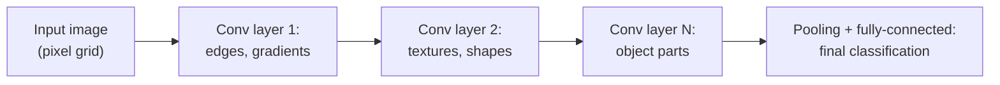

(ch-39)=
# 39. Computer Vision: CNNs, Detection, Segmentation, and Diffusion Models
This entire book, up to this point, has been about text. [Chapter 5](#ch-05) framed a neural network layer as `activation(W * input + b)`, the same primitive whether the input is a sentence or a photograph, but the *architecture* built on top of that primitive looks meaningfully different when the input is a grid of pixels instead of a sequence of tokens. This chapter is the short version of the vision half of deep learning that a text-focused book like this one otherwise skips entirely.

**Convolutional Neural Networks (CNNs)** are the foundational vision architecture, and the key insight is a specific kind of parameter sharing. A fully-connected layer ([Chapter 5](#ch-05)) applied directly to a 1920x1080 image would need a separate weight for every input pixel times every output neuron, an unusable number of parameters. A **convolution** instead slides a small learned filter (say, 3x3 pixels) across the entire image, reusing the *same* small set of weights at every position, the same design principle as a stream-processing function applied identically to every element of a collection rather than writing bespoke logic per array index. Early layers' filters learn to detect simple local patterns (edges, corners, color gradients); deeper layers combine those into increasingly abstract features (textures, object parts, whole objects), a compositional hierarchy conceptually similar to how a compiler's lexer produces tokens, its parser combines tokens into an AST, and later passes combine AST nodes into progressively higher-level program structure.

A well-trained CNN can go extremely deep, dozens or hundreds of layers, but naively stacking layers eventually makes training *worse*, not better, because gradients ([Chapter 36](#ch-36)) shrink to near-zero by the time they backpropagate through that many layers (the "vanishing gradient" problem). **ResNet** ([He et al., 2016](../references.md#ref-resnet)) fixed this with **residual connections**: each block learns only the *change* it should make to its input, and adds that change to the original input passed straight through, rather than transforming the input from scratch. This is structurally identical to the LoRA pattern from [Chapter 24](#ch-24) (`W_effective = W + delta`), applied decades earlier, for a different reason (trainability at depth, not parameter efficiency), and it's what made networks over 100 layers deep practical to train at all.

CNNs power three related but distinct vision tasks:

| Task | Question it answers | Typical output |
|---|---|---|
| **Classification** | What is this image, overall? | A single label: `"cat"` |
| **Object detection** | What objects are present, and where? | Bounding boxes + labels: `cat at (120,80)-(340,290)` |
| **Segmentation** | Which exact pixels belong to which object? | A pixel-level mask, not just a box |

**Diffusion models**, the technique behind modern image generation, take a completely different approach from the GAN framing in [Chapter 4](#ch-04): rather than a generator and discriminator competing, a diffusion model learns to reverse a gradual noising process ([Ho et al., 2020](../references.md#ref-ddpm)). Training takes a real image, adds a little random noise, then a little more, across many steps, until it's pure static, and trains a network to predict and remove that noise one step at a time. Generation runs the process backward: start from pure random noise and repeatedly denoise, step by step, until a coherent image emerges, the way iteratively sharpening a blurry JPEG through successive refinement passes would, except each pass is a learned function rather than a fixed sharpening filter. This step-by-step, iterative-refinement approach turned out to produce dramatically higher-fidelity, more stable results than the single-shot adversarial approach GANs use, which is why diffusion, not GANs, backs most of today's image and video generation systems.

**Further reading:** He, K., Zhang, X., Ren, S., & Sun, J. (2016). [Deep Residual Learning for Image Recognition](https://arxiv.org/abs/1512.03385). *CVPR 2016* · Ho, J., Jain, A., & Abbeel, P. (2020). [Denoising Diffusion Probabilistic Models](https://arxiv.org/abs/2006.11239). *NeurIPS 2020*.

---

[← Chapter 38: Feature Engineering](#ch-38) &nbsp;|&nbsp; [Table of Contents](../index.md) &nbsp;|&nbsp; [Chapter 40: From RNNs to Transformers: Why Attention Won →](#ch-40)
