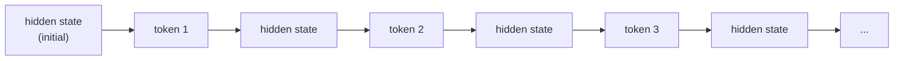

(ch-40)=
# 40. From RNNs to Transformers: Why Attention Won
[Chapter 7](#ch-07) introduced the Transformer as *the* architecture behind modern language models and cited [Vaswani et al. (2017)](../references.md#ref-attention), but the book never explained what came before it, or why that earlier approach lost. Understanding the predecessor makes the Transformer's design choices land as *solutions to specific problems*, not just an arbitrary architecture that happened to work.

Before Transformers, the standard architecture for sequential data (text, time series, audio) was the **Recurrent Neural Network (RNN)**: process a sequence one token at a time, carrying forward a "hidden state," a running summary of everything seen so far, and updating it at each step.

This is structurally identical to a `reduce`/`fold` operation over a stream: `state = combine(state, nextElement)`, applied one element at a time, where `combine` is a learned function instead of a hand-written one. And that sequential structure is exactly the RNN's fatal weakness, for two separate reasons.

**First, vanishing gradients over long sequences.** Information from token 1 has to survive being repeatedly transformed through every subsequent step before it can influence token 500; in practice, that signal decays toward nothing, the same way floating-point precision degrades after enough repeated operations. **LSTM** ([Hochreiter & Schmidhuber, 1997](../references.md#ref-lstm)) partially fixed this with gating mechanisms, learned "forget," "input," and "output" gates that let the network explicitly decide what to keep, discard, or expose at each step, closer to a cache with an explicit eviction policy than a plain running accumulator. LSTMs meaningfully extended how far back a model could "remember," but they didn't remove the sequential bottleneck.

**Second, and more consequentially for how the field moved: no parallelism.** Computing the hidden state at step 500 strictly requires having already computed it at step 499, which requires step 498, and so on, an inherently serial dependency chain, the same shape as a single-threaded pipeline where every stage must wait for the previous one to finish before starting. On modern GPUs, built for exactly the kind of massively parallel work [Chapter 26](#ch-26) described, an architecture that *cannot* be parallelized across the sequence length leaves most of the hardware idle. Training an RNN on long documents was, computationally, agonizingly slow.

The Transformer's **self-attention** mechanism solves both problems in one move: instead of a hidden state carried step by step, every token directly attends to every other token in the sequence *simultaneously*, computing a weighted combination of all other tokens' representations in a single parallel matrix operation, no sequential carry-forward required.

| | RNN / LSTM | Transformer (attention) |
|---|---|---|
| How a token accesses earlier context | Indirectly, through a compressed hidden state passed step by step | Directly, via a weighted lookup over every earlier token at once |
| Parallelizable across sequence length? | No, strictly sequential | Yes, all positions computed simultaneously |
| Long-range dependency handling | Degrades with distance, even with LSTM's gating | Any two tokens are one attention "hop" apart, regardless of distance |
| GPU utilization | Poor, sequential dependency chain | Excellent, matches the hardware's parallel design |

This is the actual reason "Attention Is All You Need" was such a consequential title: it wasn't that attention made models smarter per se, it was that removing the sequential bottleneck made it *practical* to train vastly larger models on vastly more data, which is what actually unlocked the scaling that produced modern LLMs, a case where a systems/hardware-fit argument, not a pure accuracy argument, is what won the architecture war. RNNs and LSTMs haven't vanished entirely (some newer architectures revisit recurrence for very long sequences at lower memory cost), but for the vast majority of language and generative modeling work today, the Transformer's parallelism advantage settled the question.

**Further reading:** Hochreiter, S., & Schmidhuber, J. (1997). [Long Short-Term Memory](https://doi.org/10.1162/neco.1997.9.8.1735). *Neural Computation*, 9(8), 1735–1780.

---

[← Chapter 39: Computer Vision](#ch-39) &nbsp;|&nbsp; [Table of Contents](../index.md) &nbsp;|&nbsp; [Chapter 41: Reinforcement Learning and RLHF: How Chat Models Learn to Be Helpful →](#ch-41)
