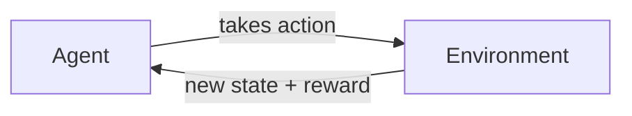
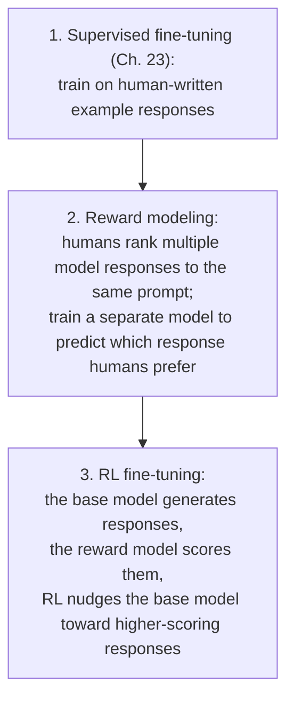

(ch-41)=
# 41. Reinforcement Learning and RLHF: How Chat Models Learn to Be Helpful
Here's a question this book has quietly skipped: [Chapter 7](#ch-07) explained that a language model just predicts the next token, and [Chapter 23](#ch-23) explained fine-tuning as learning from `(prompt, completion)` pairs. Neither explains why the chat model you actually talk to responds like a helpful assistant instead of just continuing your text the way raw internet writing would. That gap is filled by **reinforcement learning**, and specifically by RLHF, the step that turns a raw, next-token-predicting base model into something that behaves like a chat assistant at all.

**Reinforcement learning (RL)**, at a high level, is a different learning paradigm from everything else in this book. [Chapter 4](#ch-04) covered supervised learning (learn from labeled examples) and unsupervised learning (learn structure with no labels); RL is a third category entirely: an **agent** takes **actions** in an **environment**, receives a **reward** signal indicating how good that action was, and learns a **policy** (a strategy for choosing actions) that maximizes cumulative reward over time, through trial and error rather than from a fixed dataset of correct answers.

This is structurally close to a feedback-control loop, or to A/B-testing a strategy against live traffic and adjusting based on outcomes, rather than training on a static labeled dataset the way [Chapter 23](#ch-23)'s fine-tuning does: there's no single "correct answer" provided upfront, only a signal of how good an outcome turned out to be, discovered by acting and observing the consequence.

**RLHF (Reinforcement Learning from Human Feedback)** applies this framework to language models, with a specific, clever twist to work around a problem: "how good was this chat response" isn't something you can compute with a formula the way "did the game agent win or lose" can be. The fix, formalized by [Christiano et al. (2017)](../references.md#ref-rlhf) and applied at scale to instruction-following chat models by [Ouyang et al. (2022)](../references.md#ref-instructgpt) in the InstructGPT paper (the direct ancestor of ChatGPT's training recipe), is to *learn* the reward signal from human preferences rather than hand-write it.

The key insight: you can't ask a human to rate every single training example at the scale needed to train a multi-billion-parameter model, but you *can* ask humans to rank a manageable number of response pairs ("which of these two answers is more helpful?"), train a smaller **reward model** to imitate that human judgment, and then use the reward model as a fast, automatable stand-in for a human rater during the actual RL training loop. It's the same "distill an expensive, slow signal into a cheap, fast proxy" pattern behind [Chapter 21](#ch-21)'s LLM-as-judge technique, applied one level earlier, in training rather than evaluation.

This is precisely why chat models feel helpful, harmless, and conversational in a way raw completion of internet text never would: the base model ([Chapter 6](#ch-06)'s pretrained checkpoint) already knows language and facts, but RLHF is the stage that specifically teaches it to *prefer* being concise, honest, and on-task over merely plausible, because that preference is exactly what the reward model was trained to reward. It's also why RLHF-tuned models can develop quirks like excessive hedging or a tendency to over-praise a user's ideas: the reward model is only as good as the human preference data it learned from, and any systematic bias in that data (raters preferring longer, more agreeable-sounding answers, for instance) gets baked directly into the resulting model's behavior.

**Further reading:** Christiano, P. F., Leike, J., Brown, T., Martic, M., Legg, S., & Amodei, D. (2017). [Deep Reinforcement Learning from Human Preferences](https://arxiv.org/abs/1706.03741)*. NeurIPS 2017* · Ouyang, L. et al. (2022). [Training Language Models to Follow Instructions with Human Feedback](https://arxiv.org/abs/2203.02155). *NeurIPS 2022*.

---

[← Chapter 40: From RNNs to Transformers](#ch-40) &nbsp;|&nbsp; [Table of Contents](../index.md) &nbsp;|&nbsp; [Chapter 42: MLOps for Classical ML: Feature Stores, Experiment Tracking, and Data Versioning →](#ch-42)
