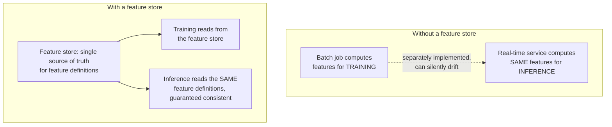

(ch-42)=
# 42. MLOps for Classical ML: Feature Stores, Experiment Tracking, and Data Versioning
Part IV covered production operations in real depth, but every chapter there (health dashboards, observability, versioning) was scoped specifically to *LLM serving*. Classical ML systems ([Chapter 35](#ch-35)), the regression models, tree ensembles, and recommenders quietly running behind fraud detection, pricing, and ranking, have their own, older, equally real production discipline, and it's shaped differently because the failure modes are different: an LLM mostly fails at *inference time* in ways you can watch happen; a classical ML pipeline just as often fails *upstream*, silently, in the data feeding training.

[Sculley et al. (2015)](../references.md#ref-hidden-debt) named this precisely in a paper that's become foundational to how the industry thinks about ML infrastructure: machine learning code itself is often a small fraction of a real ML system, and the surrounding "glue code," data pipelines, feature computation, monitoring, is where most of the technical debt actually accumulates. Three infrastructure patterns exist specifically to manage that debt.

**Experiment tracking.** Training a classical model isn't a one-shot event: it's dozens or hundreds of runs, each with different hyperparameters, feature sets, or data snapshots, and "which run produced the model currently in production, and with what settings" is exactly the kind of question that becomes unanswerable without tooling. Tools like **MLflow** and **Weights & Biases** log every run's hyperparameters, metrics, and resulting model artifact automatically, the ML equivalent of a CI system's build history: every build (training run) is timestamped, its inputs are recorded, its outputs are archived, and you can always answer "what exactly produced this artifact" without relying on someone's memory or a spreadsheet.

```
run_id: a3f21c   params: {max_depth: 6, learning_rate: 0.1, n_estimators: 200}
                 metrics: {auc: 0.891, precision: 0.74, recall: 0.68}
                 artifact: s3://models/fraud-detector/a3f21c/model.pkl
```

**Data versioning.** [Chapter 33](#ch-33) stressed pinning exact model checkpoints and prompt versions for LLM rollback; classical ML needs the same discipline applied one layer earlier, to the *training data itself*. A model trained on "last month's transactions table" is not reproducible if that table has since been updated, deleted rows, or had its schema changed, the same problem `git` solves for source code, applied to datasets. Tools like **DVC (Data Version Control)** hash and version large data files alongside code, so a specific model version can always be traced back to the exact data snapshot that produced it, not just an approximate description of it.

**Feature stores.** This is the pattern with no real LLM-world analogue, and it solves a specific, nasty bug class: **training/serving skew**. A model is trained offline using a feature like `average_purchase_amount_last_30_days`, computed via a batch SQL query over historical data. At inference time, in production, that same feature has to be computed *identically*, often in a completely different code path (a real-time service, not a batch job), and if the two implementations drift even slightly, the model silently sees different-shaped input in production than it did in training, a subtle mismatch that degrades accuracy without throwing any error.



A **feature store** (Feast is the common open-source option) centralizes feature computation logic in one place, so both the offline training pipeline and the online serving path pull from the exact same definitions, closing the gap that would otherwise let training and serving quietly diverge. It's the classical-ML equivalent of the "same JSON contract, same client code" principle [Chapter 17](#ch-17) described for OpenAI-compatible APIs: one authoritative definition, consumed identically by every caller, rather than two independently-maintained implementations that are supposed to agree but eventually won't.

**Further reading:** Sculley, D. et al. (2015). [Hidden Technical Debt in Machine Learning Systems](https://proceedings.neurips.cc/paper/2015/hash/86df7dcfd896fcaf2674f757a2463eba-Abstract.html). *NeurIPS 2015*.

---

[← Chapter 41: Reinforcement Learning and RLHF](#ch-41) &nbsp;|&nbsp; [Table of Contents](../index.md) &nbsp;|&nbsp; [Chapter 43: Agents and Multimodality: Planning, Memory, and Vision-Language Models →](#ch-43)
