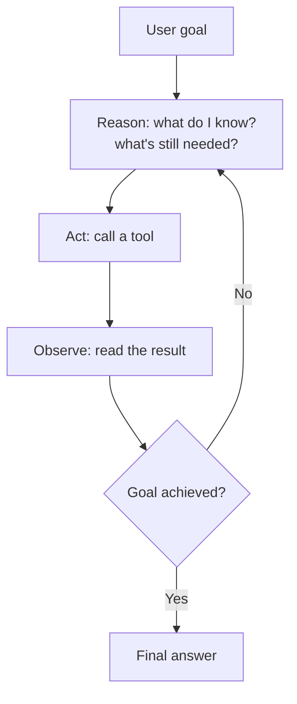

(ch-43)=
# 43. Agents and Multimodality: Planning, Memory, and Vision-Language Models
[Chapter 15](#ch-15) covered function calling: a model emits a structured request, your code executes it, the result goes back into context. That's a single round trip, and it's genuinely most of what "tool use" means in production today. But the word **agent** gets used for something more ambitious: a system that plans multiple steps ahead, calls several tools in sequence, adapts when a step fails, and maintains state across a much longer task than one prompt-response cycle. This chapter covers what changes once you go from one tool call to many, and, briefly, what happens when the input isn't text at all.

**From one tool call to a loop.** [Chapter 15](#ch-15) cited [Yao et al.'s ReAct](../references.md#ref-react), which interleaves *reasoning* text with *action* calls, and that interleaving is the seed of everything agentic frameworks do: instead of one shot at "call a tool, get a result, answer," the model repeatedly reasons about what it's learned so far and decides whether to call another tool, revise its plan, or stop.

This is structurally close to a `while` loop with a bounded iteration count and an explicit exit condition, except the "condition" and the "next action" are both decided by the model itself at each iteration, not by code you wrote in advance. That's exactly why the engineering discipline from [Chapter 19](#ch-19) (prompt injection) and [Chapter 20](#ch-20) (never let raw model output trigger an action without validation) matters *more*, not less, in a multi-step agent: every additional loop iteration is another opportunity for the model to be steered off-task by something it read along the way, and errors compound across steps instead of staying isolated to one call.

**Memory across a long task** is a genuinely different problem from the KV-cache session affinity [Chapter 28](#ch-28) covered, which keeps *inference* fast across turns of the *same* conversation. Agent memory is about what the agent explicitly carries forward as *facts*, not raw token history: a running scratchpad of intermediate findings, a summary of completed subtasks, or retrieved facts from a previous session ([Chapter 18](#ch-18)'s RAG pattern, reused here as the agent's own long-term memory rather than a user-facing knowledge base). The practical failure mode to watch for is the same context-window arithmetic [Chapter 32](#ch-32) flagged: a long-running agent that keeps appending every tool result to its context will eventually exhaust the window, so real agent implementations periodically summarize or discard stale intermediate state rather than keeping the entire history verbatim.

**Multi-agent orchestration** takes this one step further: instead of one model doing everything, multiple agents, sometimes the same underlying model invoked with different system prompts and tool sets, sometimes genuinely different models, each specialize in a subtask (a "researcher" agent, a "coder" agent, a "reviewer" agent) and pass work between each other. This is the same decomposition principle behind splitting a monolith into services with clear responsibilities, applied to LLM calls: each agent gets a narrower, better-specified job, at the cost of the coordination overhead ([Chapter 31](#ch-31)'s multi-tenant scheduling concerns, now applied between cooperating agents rather than competing tenants) that any distributed system pays for splitting work across components.

**Multimodality**, briefly: everything in this book assumes text in, text out, but the same Transformer backbone ([Chapter 7](#ch-07), [Chapter 40](#ch-40)) generalizes to other modalities by changing how the input is *encoded* into the same kind of token sequence the model already operates on. **CLIP** ([Radford et al., 2021](../references.md#ref-clip)) demonstrated the key technique: train an image encoder and a text encoder jointly, so that a picture of a dog and the text "a photo of a dog" land in the *same* embedding space ([Chapter 9](#ch-09)'s vector-similarity idea, applied across modalities rather than within one). A vision-language model built on this idea can take an image, encode it into that shared space, and let the language model attend over it exactly as it would attend over text tokens, no separate architecture required, just a shared representation both modalities map into. This is also the bridge that makes text-to-image generation possible: a text prompt is encoded into that shared space, and a diffusion model ([Chapter 39](#ch-39)) is conditioned on that encoding to steer the image it generates toward matching the prompt's meaning.

**Further reading:** Radford, A. et al. (2021). [Learning Transferable Visual Models From Natural Language Supervision](https://arxiv.org/abs/2103.00020) (CLIP). *ICML 2021*.

---

[← Chapter 42: MLOps for Classical ML](#ch-42) &nbsp;|&nbsp; [Table of Contents](../index.md) &nbsp;|&nbsp; [Chapter 44: Pretraining at Scale: Data, Tokenizers, and Scaling Laws →](#ch-44)
